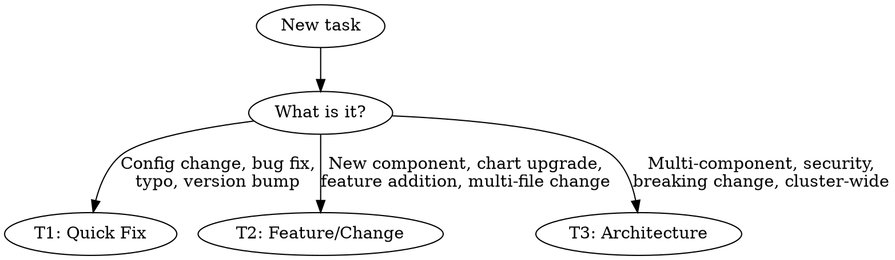
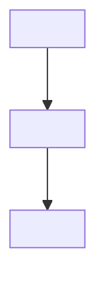

# Issue-to-PR Workflow

## Overview

Structured workflow: task → tiered GitHub issue → branch → implementation → PR. Issue format scales with complexity. Every change gets an issue first.

## When to Use

- Starting any new task or feature
- Creating a GitHub issue before implementation
- Creating a branch for work
- Opening a PR to merge changes

## Tier Classification



| Tier | For | Issue Format | Branch Prefix |
|------|-----|-------------|---------------|
| **T1** | Config changes, bug fixes, typos, version bumps | Minimal (Why, What, Checklist) | `fix/` |
| **T2** | New components, chart upgrades, feature additions | Full (Why, Goals, Mermaid, Files, Tasks, Acceptance) | `feat/` |
| **T3** | Multi-component, security, breaking changes, cluster-wide | Full + Risk Assessment, Rollback Plan, Affected Services | `feat/` |

**When in doubt, tier up.** A "small fix" touching 3 services is T2, not T1.

## Workflow Steps

### Step 1: Classify the Tier

Classify before creating the issue. Apply the tier definitions above.

### Step 2: Create the GitHub Issue

Use `gh issue create` with the appropriate template below. The issue title format is:

- T1: `[T1] <short description>` (e.g., `[T1] Fix invenio-web probe timeouts`)
- T2: `[T2] <short description>` (e.g., `[T2] Upgrade Invenio to v12.0`)
- T3: `[T3] <short description>` (e.g., `[T3] Migrate secrets to centralized management`)

#### T1 Template (Minimal)

```markdown
## Why
<1-2 sentences on motivation — what problem does this solve?>

## What
- <specific change 1>
- <specific change 2>

## Checklist
- [ ] <verification step 1>
- [ ] <verification step 2>
```

#### T2 Template (Full)

```markdown
## Why
<problem statement — what is broken, missing, or needs changing>

## Goals
| # | Goal | Why |
|---|---|---|
| 1 | <goal> | <rationale> |

## Architecture


**Key principle:** <1 sentence summarizing the design decision>

## Files Overview
| File | Type | Description |
|---|---|---|
| <path> | New/Modified | <what it does> |

## Task Groups
- [ ] **Group 1**: <description>
- [ ] **Group 2**: <description>

## Acceptance Criteria
- [ ] <testable condition 1>
- [ ] <testable condition 2>
```

#### T3 Template (Full + Risk)

All of T2, plus:

```markdown
## Risk Assessment
| Risk | Impact | Mitigation |
|---|---|---|
| <what could go wrong> | <severity> | <how to prevent/recover> |

## Rollback Plan
1. <step to revert>
2. <step to verify rollback>

## Affected Services
- <service-a>
- <service-b>
```

### Step 3: Create the Branch

Branch from `main`. Name format: `<prefix>/<issue-number>-<short-slug>`

**Examples:**
- `fix/42-probe-timeouts`
- `feat/55-invenio-v12-upgrade`
- `feat/61-centralized-secrets`

```bash
git checkout main
git pull origin main
git checkout -b <prefix>/<issue-number>-<short-slug>
```

### Step 4: Implement

- Reference the issue in commits: `feat: add probe tuning (#42)` or `fix: increase probe timeouts (#42)`
- Follow the task groups from the issue in order
- Check off task groups in the issue as they are completed

### Step 5: Create the PR

```bash
gh pr create --title "[T1/T2/T3] <description>" --body "$(cat <<'EOF'
Closes #<issue-number>

## Summary
<what changed and why>

## Changes
- <change 1>
- <change 2>

## Testing
- [ ] <how it was verified>

<!-- For T3 only -->
## Rollback
<steps to revert if needed>
EOF
)"
```

## Rules

1. **No branch without an issue** — always create the issue first
2. **Branch name includes issue number** — `feat/42-short-name` or `fix/12-short-name`
3. **Mermaid diagram required for T2+** when multiple components interact — if it touches 2+ services/configs, diagram it
4. **Rollback plan required for T3** — infra changes that could break services must have rollback steps
5. **PR must close the issue** — include `Closes #<issue-number>` in PR body
6. **Tier up when in doubt** — a small change touching many services is not T1

## Quick Reference

| Action | Command |
|--------|---------|
| Create T1 issue | `gh issue create --title "[T1] <desc>" --body "$(cat <<'EOF'\n## Why\n<why>\n\n## What\n- <change>\n\n## Checklist\n- [ ] <check>\nEOF\n)"` |
| Create T2/T3 issue | `gh issue create --title "[T2/T3] <desc>" --body "$(cat <<'EOF'\n<full template>\nEOF\n)"` |
| Create branch | `git checkout -b <prefix>/<number>-<slug>` |
| Create PR | `gh pr create --title "[T?] <desc>" --body "Closes #<number>..."` |
| List open issues | `gh issue list` |
| View issue | `gh issue view <number>` |

## Common Mistakes

| Mistake | Fix |
|---------|-----|
| Creating a branch without an issue | Create the issue first, then branch |
| T1 issue for a change touching 3 services | Tier up to T2 or T3 |
| Skipping the mermaid diagram for a T2 | If it involves multiple components, diagram it |
| Vague acceptance criteria | Write testable conditions ("ArgoCD syncs successfully", not "it works") |
| Missing rollback plan on T3 | Every T3 must have explicit revert steps |
| PR not referencing the issue | Always include `Closes #<number>` |
