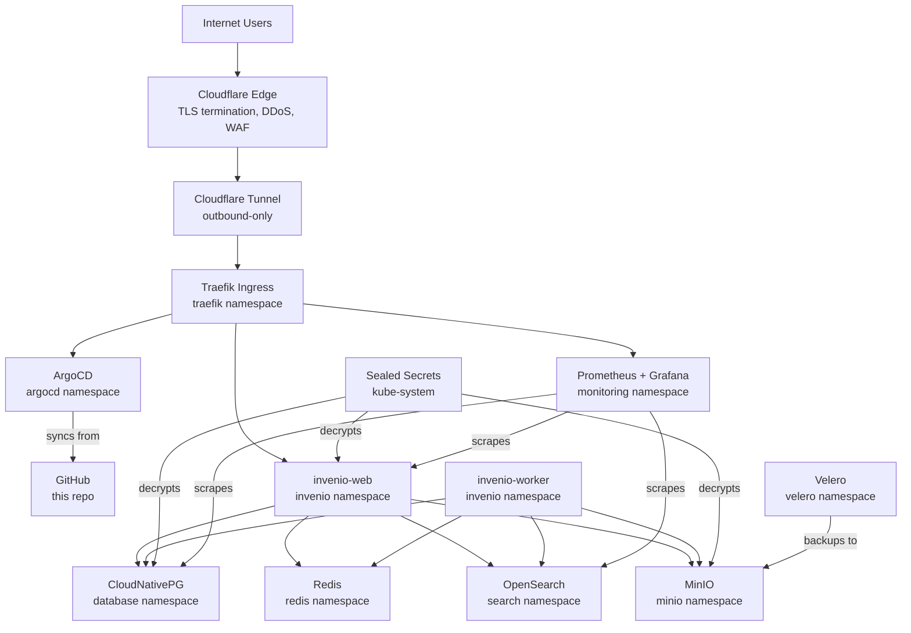
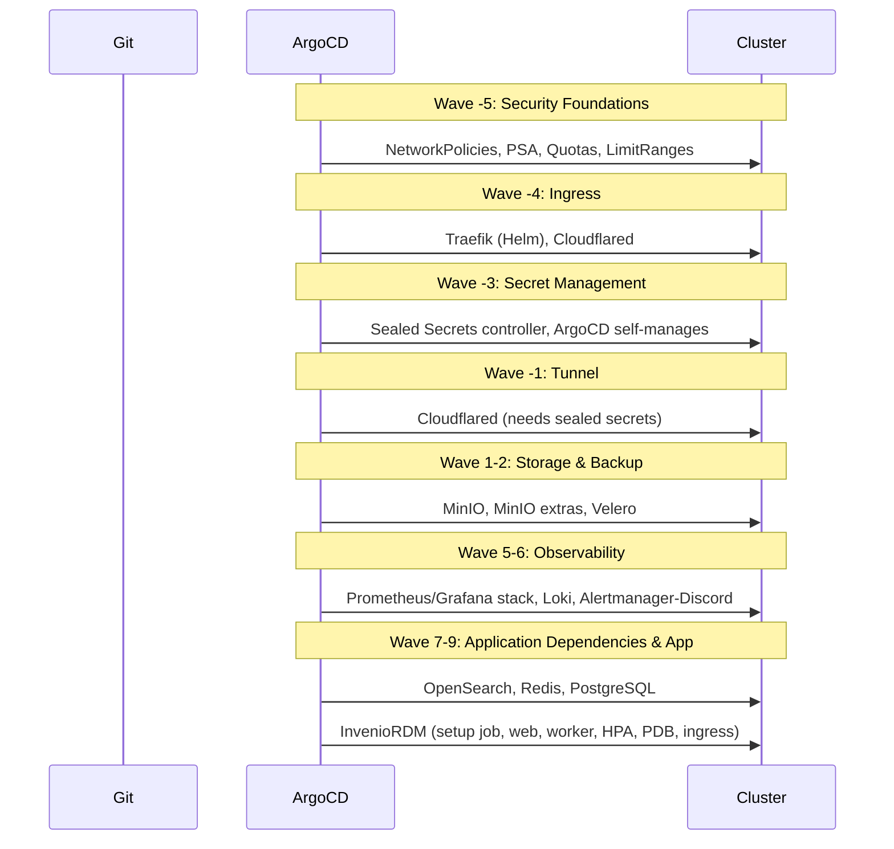
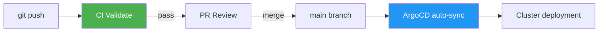

# InvenioRDM GitOps Infrastructure

[](https://github.com/vityasyyy/invenio-rdm-gitops/actions/workflows/validate-infra.yaml)
[](LICENSE)

Production Kubernetes infrastructure for [InvenioRDM](https://inveniosoftware.org/products/rdm/), managed entirely through GitOps with ArgoCD. Deploys the full stack — from load balancer to application — with zero inbound firewall ports.

## Architecture



## Quick Start

```bash
# 1. Verify cluster prerequisites
./scripts/verify-infra.sh

# 2. Bootstrap ArgoCD (installs ArgoCD; everything else auto-syncs from Git)
./scripts/bootstrap-infra.sh

# 3. Activate Cloudflare Tunnel
./external-lb/scripts/bootstrap-dev.sh

# 4. Verify everything is running
./scripts/verify-infra.sh

# 5. Log into ArgoCD and change default password
#    URL: https://argocd.vityasy.me
#    Username: admin
#    Password: (from bootstrap-infra.sh output)
```

## Repository Structure

```
├── argocd/                    # ArgoCD Application manifests (app-of-apps pattern)
│   ├── apps/                  # One YAML per application (16 apps total)
│   ├── projects/              # AppProject RBAC definitions
│   └── root.yaml              # Root app that bootstraps all others
├── k8s/
│   ├── apps/invenio/          # InvenioRDM web, worker, HPA, PDB, ingress
│   ├── apps/invenio-deps/     # PostgreSQL (CNPG), Redis, OpenSearch
│   └── infra/                 # Infrastructure components
│       ├── argocd/            # ArgoCD kustomize + security patches
│       ├── argocd-image-updater/
│       ├── loki/              # Log aggregation
│       ├── minio/             # S3-compatible storage
│       ├── monitoring/        # Prometheus, Grafana, Alertmanager, Discord bridge
│       ├── security/          # NetworkPolicies, PodSecurityAdmission, quotas
│       ├── sealed-secrets/
│       ├── traefik/           # Ingress controller
│       └── velero/            # Backup/DR
├── external-lb/               # Cloudflare Tunnel (Terraform + DaemonSet)
├── docker/invenio/            # Custom InvenioRDM Docker image
├── scripts/                   # Bootstrap, verify, CI, and secret generation scripts
└── secrets/                   # Gitignored directory for local secret material
```

## Sync Waves & Boot Order

ArgoCD orchestrates deployment through sync waves — infrastructure with negative waves deploys first, then databases, then the application layer.



| Wave | App | What it deploys |
|------|-----|-----------------|
| -5 | security-policies | NetworkPolicies, PSA labels, ResourceQuotas, LimitRanges |
| -4 | traefik | Traefik ingress controller (Helm) |
| -3 | sealed-secrets | Sealed Secrets controller (kube-system) |
| -3 | argocd-self | ArgoCD self-management (kustomize + security patches) |
| -1 | cloudflared | Cloudflare Tunnel DaemonSet (kube-system) |
| 1 | minio | MinIO S3 storage (Helm) |
| 2 | minio-extras | MinIO console IngressRoute, bucket creation Job |
| 2 | velero | Velero backup (Helm + manifests) |
| 2 | argocd-image-updater | Tracks GHCR for Invenio image updates |
| 5 | loki | Loki log aggregation (Helm) |
| 5 | monitoring | kube-prometheus-stack (Helm) |
| 6 | monitoring-extras | Alertmanager-Discord bridge, Loki netpol |
| 7 | invenio-opensearch | OpenSearch (Helm + manifests) |
| 7 | invenio-redis | Redis (raw manifests) |
| 7 | invenio-postgresql | CloudNativePG operator (Helm + manifests) |
| 9 | invenio-bootstrap | InvenioRDM full stack (kustomize) |

## Secrets Management


**Key points:**
- Only ciphertext is committed to Git (`spec.encryptedData` starts with `Ag`)
- Plaintext exists only locally under `secrets/` (gitignored)
- Rotation: override env vars and rerun `./scripts/generate-sealed-secrets.sh`
- **Back up the private key!** Without it, all sealed secrets are permanently lost

```bash
# Export the private key for disaster recovery
kubectl get secret -n kube-system sealed-secrets-key* \
  -o jsonpath='{.data.tls\.key}' | base64 -d > secrets/sealed-secrets-private.pem

# Generate / rotate sealed secrets
./scripts/generate-sealed-secrets.sh           # all components
./scripts/generate-sealed-secrets.sh invenio   # Invenio only
```

## Access & Services

| Service | URL / Endpoint | Auth Source |
|---------|---------------|-------------|
| ArgoCD UI | `https://argocd.vityasy.me` | `argocd-initial-admin-secret` |
| Grafana UI | `https://grafana.vityasy.me` | SealedSecret `monitoring-grafana` |
| MinIO Console | `https://minio-console.vityasy.me` | SealedSecret `minio-credentials` |
| MinIO S3 API | `minio.minio.svc.cluster.local:9000` (internal) | SealedSecret `minio-credentials` |
| Invenio RDM | `https://invenio.vityasy.me` | Invenio internal auth |
| Invenio API | `https://api-invenio.vityasy.me` | Invenio internal auth |

## CI/CD Pipeline



**CI checks** (runs on every PR to `main`):

| Check | What it validates |
|-------|-------------------|
| Validate YAML Syntax | yamllint on all YAML files |
| Render & Validate Manifests | kustomize build + kubeconform + selector validation + SealedSecret format |
| Validate ArgoCD Applications | kube-linter + app path references + project RBAC |
| Verify Sync Wave Ordering | Correct wave dependencies, no infra apps in positive waves |
| Scan for Secrets | gitleaks — no plaintext secrets in git |

**Branch protection:** 1 required review, linear history, status checks must pass, no force pushes.

**Deploy verification** (runs on push to `main`):

After merge, a separate workflow waits up to 5 minutes for all ArgoCD apps to reach `Synced` + `Healthy` status, then runs a smoke test against the Invenio health endpoint.

## Operations

### Day-1: Bootstrap from Scratch

```bash
# 1. Bootstrap base infrastructure and tunnel
./scripts/bootstrap-infra.sh
./external-lb/scripts/bootstrap-dev.sh
./scripts/verify-infra.sh

# 2. Confirm ArgoCD infra apps are healthy
kubectl -n argocd get applications

# 3. Apply Invenio app definition
kubectl apply -f argocd/apps/invenio-bootstrap.yaml

# 4. Wait for rollout
kubectl -n invenio rollout status deploy/invenio-web --timeout=180s
```

### Day-2: Upgrades & Rollbacks

```bash
# Update versions/manifests in Git, then:
git push origin main
argocd app sync invenio-bootstrap
argocd app wait invenio-bootstrap --health --timeout 300

# Rollback via Git revert (ArgoCD auto-syncs)
git revert <bad-commit-sha>
git push origin main

# Emergency app-level rollback
argocd app history invenio-bootstrap
argocd app rollback invenio-bootstrap <history-id>
```

### Secret Rotation

```bash
# Rotate Invenio secrets
INVENIO_SECRET_KEY="$(openssl rand -hex 32)" ./scripts/generate-sealed-secrets.sh invenio

# Rotate infrastructure secrets
./scripts/generate-sealed-secrets.sh minio grafana velero
```

### Backup & Restore

```bash
# Check backup freshness
kubectl -n velero get backupstoragelocation default -o jsonpath='{.status.phase}'
kubectl -n velero get schedule weekly-infra-backup

# Manual backup trigger
BACKUP_NAME="manual-infra-$(date +%Y%m%d-%H%M%S)"
velero backup create "$BACKUP_NAME" \
  --include-namespaces argocd,traefik,monitoring,minio,invenio,velero \
  --storage-location default --ttl 168h --wait

# Restore drill (safe canary)
DRILL_ID="$(date +%Y%m%d-%H%M%S)"
kubectl -n velero create configmap restore-drill-canary \
  --from-literal=drill-id="$DRILL_ID" --from-literal=source=velero-readiness \
  --dry-run=client -o yaml | kubectl apply -f -
# ... (see SETUP.md for full drill procedure)
```

### Incident Triage

```bash
# Control plane health
kubectl -n argocd get applications
kubectl get pods -A --field-selector=status.phase!=Running

# Invenio namespace quick triage
kubectl -n invenio get all
kubectl -n invenio describe deploy invenio-web
kubectl -n invenio logs deploy/invenio-web --tail=200

# Dependency checks
kubectl -n invenio get svc invenio-postgresql invenio-redis invenio-search
kubectl -n minio get svc minio

# Tunnel/ingress
kubectl -n kube-system get ds cloudflared
kubectl -n traefik get pods,svc
```

## Security

- **Zero inbound ports**: Cloudflare Tunnel creates outbound-only connections — no firewall holes needed
- **DDoS protection**: All traffic flows through Cloudflare's global network
- **Encrypted-at-rest secrets**: SealedSecrets are safe to commit to Git (ciphertext only)
- **Pod security**: All namespaces enforce Pod Security Admission (`restricted` or `baseline`)
- **Network policies**: Default-deny ingress in all application namespaces, explicit allow rules for required traffic paths
- **Non-root containers**: All workloads run as non-root with dropped capabilities and `seccompProfile: RuntimeDefault`
- **Resource quotas**: Every namespace has CPU/memory limits to prevent resource exhaustion

## Disaster Recovery

If the cluster is destroyed and needs to be rebuilt:

```bash
# 1. Restore Sealed Secrets private key (MUST be backed up beforehand)
kubectl create secret tls sealed-secrets-key \
  -n kube-system \
  --cert=secrets/sealed-secrets-public.pem \
  --key=secrets/sealed-secrets-private.pem

# 2. Re-bootstrap infrastructure
./scripts/bootstrap-infra.sh
./external-lb/scripts/bootstrap-dev.sh

# 3. ArgoCD will automatically sync all SealedSecrets,
#    the controller decrypts them into Kubernetes Secrets
# 4. Verify
./scripts/verify-infra.sh
```

## Contributing

1. Create a feature branch from `main`
2. Make changes to manifests
3. Open a PR — CI must pass (yamllint, kustomize build, kubeconform, selector validation, secret scanning)
4. After review, merge to `main`
5. ArgoCD auto-syncs changes to the cluster (~30s)

See `.opencode/skills/issue-to-pr-workflow/SKILL.md` for the structured issue-to-PR workflow used in this repo.

## License

MIT