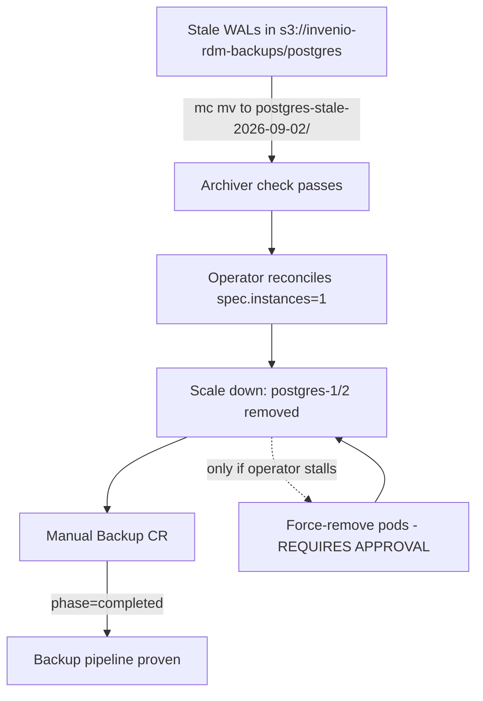

# CNPG Postgres Cluster Recovery to Declared Single-Instance State — Implementation Plan

> **Issue:** #76 (T3) — Recover CNPG postgres cluster to declared single-instance state.
> **Branch:** `fix/74-db-recovery` (worktree `.worktrees/fix/74-db-recovery`; branch slug references #74, the actual issue is **#76**).
> **Status:** **PLANNED 2026-09-02** — diagnosis complete, execution steps prepared. All mutations require lead execution with user approval; this wave is docs-only.

> **For agentic workers:** REQUIRED SUB-SKILL: Use superpowers:subagent-driven-development (recommended) or superpowers:executing-plans to implement this plan task-by-task. Steps use checkbox (`- [ ]`) syntax for tracking.

**Goal:** Recover the CNPG `postgres` cluster (ns `database`) to its declared single-instance state: clear the WAL-archive deadlock (reversible move-aside, not delete), let the operator reconcile to 1 instance, and prove the backup pipeline with a manual backup.

**Architecture:** The operator's reconcile loop is blocked because `barman-cloud-check-wal-archive` refuses a non-empty archive (`Expected empty archive`) — stale WALs from the pre-#54 3-instance era sit in `s3://invenio-rdm-backups/postgres`. Moving them aside (reversible `mc mv` to a sibling prefix) unblocks the check; the operator then reconciles `spec.instances: 1` (already declared in git since #53/#54) and removes the two crash-looping replicas. A manual `Backup` CR proves the pipeline. All operations are reversible; destructive pod removal is a last resort requiring explicit approval.

**Tech Stack:** CloudNativePG operator 1.25.0 (Helm chart 0.23.0, `ghcr.io/cloudnative-pg/cloudnative-pg:1.25.0`), CNPG postgres image `ghcr.io/cloudnative-pg/postgresql:16.4`, MinIO (`minio.minio.svc.cluster.local:9000`), barman-cloud, `mc` client, kubectl.

## Global Constraints

- **Read-only for this wave:** no `kubectl delete/apply/patch/scale`, no `mc rm`, no CR modification. All mutations are executed by the lead with user approval.
- **Reversible operations only:** stale WALs are *moved* to a backup prefix, never deleted. Rollback = move them back.
- **Force-removal of pods requires explicit user approval** and is only attempted if the operator will not scale down on its own.
- **Do not touch:** `k8s/apps/invenio/` (other worker's scope), `.github/`, `argocd/`, other worktrees, `docker/`.
- **502 proxy errors are issue #75** (kubelet streaming-proxy on worker-02, `10.17.117.43:10250`). If a command 502s, note it once and continue; do not retry in a loop.
- **No restore drill in this wave** — see "Restore drill (follow-up)" section; it is a separate risky step.

---

## Why

The CNPG cluster `postgres` (ns `database`) is degraded:

- `spec.instances: 1` (scaled down in #53/#54 for single-node recovery) but the operator still runs **3 pods** (`status.instances: 3`, `instanceNames: [postgres-1, postgres-2, postgres-3]`).
- `postgres-3` is the sole healthy primary (Ready=True, 1 restart, running since 2026-08-14, last restart 2026-09-02T11:34). **No HA.**
- `postgres-1` (445 restarts) and `postgres-2` (368 restarts) crash-loop for 18 days: startup probe fails (`HTTP probe failed with statuscode: 500`), container exits `Completed` (exit 0) after ~60 min, kubelet restarts it.
- `postgres-2`'s instance-manager deadlocks on WAL archiving: `barman-cloud-check-wal-archive: ERROR: WAL archive check failed for server postgres: Expected empty archive` — the archive is not empty, so the check refuses to proceed, so the instance never becomes ready, so the operator never completes the scale-down reconcile.
- Cluster conditions: `Ready=False (ClusterIsNotReady)`, `ContinuousArchiving=False (ContinuousArchivingFailing)`, `LastBackupSucceeded=False (LastBackupFailed)`.
- **1,871 Backup CRs, all `failed`** since 2026-06-04 (90 days) with `error dialing backend: proxy error from 127.0.0.1:9345 while dialing 10.17.117.43:10250, code 502` — the kubelet streaming-proxy issue tracked as **#75** (separate issue; the operator pod and postgres-1/2 pods all sit on worker-02 `10.17.117.43`).
- ScheduledBackup `postgres-daily-backup` (02:00 daily, `barmanObjectStore`, retention 30d) is stuck: `lastScheduleTime: 2026-08-21T02:02:00Z`, `nextScheduleTime: 2026-08-21T03:02:00Z` — it has not advanced since 2026-08-21 because every Backup CR creation fails.

## Goals

| # | Goal | Why |
|---|---|---|
| 1 | Clear the WAL archive deadlock (move stale WALs aside, reversible) | Unblock `barman-cloud-check-wal-archive` so the operator can reconcile |
| 2 | Reconcile CNPG to declared 1 instance | Stop restart churn (445+368 restarts), free ~2Gi requests on workers, restore Ready=True |
| 3 | Verify a manual backup completes | Prove the backup pipeline works end-to-end (blocked 90 days) |
| 4 | Document findings + restore-drill follow-up | docs-follow-code; restore drill is a separate risky step, NOT in this wave |

## Architecture



**Key principle:** reversible operations only (move-aside, never delete); destructive pod removal only with explicit operator approval; the primary (postgres-3) is never touched.

## Files Overview

| File | Type | Description |
|---|---|---|
| `k8s/apps/invenio-deps/postgresql/cluster.yaml` | Unchanged (verified) | `spec.instances: 1` already declared since #53; no manifest change needed |
| `docs/plans/active/2026-09-02-db-recovery.md` | New | This plan: diagnosis evidence + prepared execution steps |
| `docs/plans/README.md` | Modified | Index entry for this plan |
| `WORKER-REPORT.md` | New (worktree root) | Worker output contract: findings + commands for the lead |

## Diagnosis Evidence (2026-09-02, read-only)

### Cluster CR (`kubectl get cluster.postgresql.cnpg.io postgres -n database -o yaml`)

- `spec.instances: 1`, `spec.backup.barmanObjectStore.destinationPath: s3://invenio-rdm-backups/postgres`, `endpointURL: http://minio.minio.svc.cluster.local:9000`, creds from secret `minio-credentials` (ns `database`, keys `rootUser`/`rootPassword`), `retentionPolicy: 30d`, `wal.compression: gzip`.
- `status.instances: 3`, `instanceNames: [postgres-1, postgres-2, postgres-3]`, `readyInstances: 1`, `currentPrimary: postgres-3` (timeLineID 4), `healthyPVC: [postgres-1, postgres-2, postgres-3]`.
- `status.phase: 'Instance Status Extraction Error: HTTP communication issue'` — operator cannot extract status from all instances (consistent with the 502 proxy issue #75; operator pod is on worker-02).
- Conditions:
  - `Ready | False | ClusterIsNotReady | Cluster Is Not Ready`
  - `ContinuousArchiving | False | ContinuousArchivingFailing | unexpected failure invoking barman-cloud-wal-archive: exit status 1`
  - `LastBackupSucceeded | False | LastBackupFailed | cmd: [/controller/manager backup postgres-daily-backup-20260821030200] error: error dialing backend: proxy error from 127.0.0.1:9345 while dialing 10.17.117.43:10250, code 502`

### Pods (`kubectl get pods -n database -o wide`)

| Pod | Ready | Restarts | Node | Notes |
|---|---|---|---|---|
| `postgres-3` | 1/1 | 1 | worker-02 (10.17.117.43) | Healthy primary; running since 2026-08-14T14:18, last restart 2026-09-02T11:34 |
| `postgres-1` | 0/1 | 445 | worker-02 | Crash-loop: startup probe 500; container exits `Completed` (exit 0) after ~60 min |
| `postgres-2` | 0/1 | 368 | worker-01 (10.17.117.42) | Crash-loop: WAL archiver deadlock (`Expected empty archive`) |
| `invenio-postgresql-cloudnative-pg-d466fc99c-m4tr8` | 1/1 | 41 | worker-02 | CNPG operator (Helm `cloudnative-pg-0.23.0`, image 1.25.0) |

### postgres-2 logs (WAL archiver deadlock — confirmed)

Repeated every ~10 min reconcile:
```
Detected ready WAL files in a former primary, triggering WAL archiving  readyWALCount: 11
barman-cloud-check-wal-archive checking the first wal
ERROR: WAL archive check failed for server postgres: Expected empty archive
Error invoking barman-cloud-check-wal-archive ... exit status 1
Reconciler error: while ensuring all WAL files are archived: unexpected failure invoking barman-cloud-wal-archive: exit status 1
```
Options used: `--endpoint-url http://minio.minio.svc.cluster.local:9000 --cloud-provider aws-s3 s3://invenio-rdm-backups/postgres postgres`.

### Backups

- **1,871 Backup CRs, 0 completed, all `failed`** since 2026-06-04 (90d) with the 502 proxy error (issue #75). Oldest: `postgres-daily-backup-20260604070200`, `manual-baseline-backup-20260604173306`, `manual-baseline-2-20260604173627`.
- ScheduledBackup `postgres-daily-backup`: `schedule: 0 2 * * *`, `method: barmanObjectStore`, `backupOwnerReference: self`; status stuck at `lastScheduleTime: 2026-08-21T02:02:00Z` / `nextScheduleTime: 2026-08-21T03:02:00Z`; event `BackupCreation: Error while creating backup object` (4m25s ago at diagnosis time).

### MinIO bucket contents

**NOT VERIFIED — MinIO unreachable from this session.** `kubectl exec -n minio deploy/minio -- mc ls --recursive local/invenio-rdm-backups/` failed twice with `proxy error from 127.0.0.1:9345 while dialing 10.17.117.43:10250, code 502` (kubelet streaming-proxy, issue #75; MinIO pod is on worker-02). Per escalation rule, noted and not retried.

**What is expected in the bucket (from CNPG/barman semantics, to be confirmed by the lead before executing):**
- `s3://invenio-rdm-backups/postgres/wal/` — WAL segments (barman `wal/` prefix), gzip-compressed. These are the stale WALs blocking the check.
- `s3://invenio-rdm-backups/postgres/base/` — base backups (barman `base/` prefix), if any ever completed (none per Backup CRs — all failed).
- `s3://invenio-rdm-backups/postgres/backups/` — barman backup metadata (`.backup` files).
- The `Expected empty archive` error means the `wal/` prefix is non-empty; the archiver check requires it to be empty before the instance can archive its 11 ready WALs.

### Other findings

- PVCs: `postgres-1` (127d), `postgres-2` (96d), `postgres-3` (96d), all Bound, 10Gi, `btd-nfs`, RWO.
- PDB `postgres-primary` (minAvailable 1, allowed disruptions 0) — will not block scale-down of replicas.
- NetworkPolicies in `database` ns allow postgres → MinIO:9000 (`database-allow-minio`), operator ↔ instances (8000/5432), apiserver egress (443+6443). No netpol blocks the WAL archive path.
- Secret `minio-credentials` (ns `database`, Opaque, 2 keys `rootUser`/`rootPassword`) exists — used by the operator for barman.
- Nodes: worker-01 (15d old, 10.17.117.42), worker-02 (418d, 10.17.117.43), server (10.17.117.41). The 502 proxy affects worker-02 kubelet streaming (logs/exec/attach) — issue #75.
- `cluster.yaml` in git already declares `instances: 1` (since commit 1558167, #53) — **no manifest change needed**; the drift is purely in-cluster.

## Task Groups

- [ ] **Group 1 — Clear WAL deadlock**: lead executes move-aside of stale WALs (reversible), verifies archiver check passes
- [ ] **Group 2 — Reconcile to 1 instance**: operator scale-down; force-remove only with explicit user approval
- [ ] **Group 3 — Manual backup**: create Backup CR, verify `phase=completed`
- [ ] **Group 4 — Docs**: this plan + README index (done in this wave)

## Acceptance Criteria

- [ ] `kubectl get cluster.postgresql.cnpg.io postgres -n database` shows `instances=1`, `Ready=True`
- [ ] `postgres-1`/`postgres-2` pods gone; `postgres-3` healthy with 0 new restarts
- [ ] A manual Backup CR completes with `phase=completed`
- [ ] No data loss: WALs moved, not deleted (move-aside prefix intact)
- [ ] Plan doc + README index updated (this wave)

## Risk Assessment

| Risk | Impact | Mitigation |
|---|---|---|
| Force-removing replicas loses data | High | Only after operator scale-down fails; replicas are not primary; WALs preserved in move-aside prefix; PVCs retained |
| Backup still fails after WAL fix | Medium | 502 proxy is separate issue #75; document and escalate |
| Primary fails during operation | High | Single-instance cluster; brief window; verify postgres-3 healthy before starting |
| Move-aside moves the wrong objects | Medium | `mc ls` first, move only `wal/` prefix, verify count before/after |

## Rollback Plan

1. Restore moved WALs: `mc mv --recursive local/invenio-rdm-backups/postgres-stale-2026-09-02/ local/invenio-rdm-backups/postgres/wal/`
2. If replicas were force-removed: operator recreates them from the primary (replication) — or they stay gone, which is the declared state
3. Verify app connectivity: `kubectl exec -n invenio deploy/invenio-web -- python -c "..."` or app endpoints 200

## Affected Services

- `postgres` (ns `database`), `invenio-web`, `invenio-worker`, `invenio-scheduler` (all connect via `postgres-rw`)

---

## Execution Steps (lead executes with approval)

> **Preconditions:** on VPN; `kubectl` works; user has approved each mutation step. All commands are exact. **Do NOT run any of these from this docs-only wave.**

### Step 0 — Pre-flight verification (read-only)

```bash
# Confirm the primary is healthy before any mutation
kubectl get pod postgres-3 -n database -o jsonpath='{.status.conditions[?(@.type=="Ready")].status}{"\n"}{.status.containerStatuses[0].restartCount}{"\n"}'
# Expect: True / 1 (no new restarts)

# Confirm the declared state is still 1 instance
kubectl get cluster.postgresql.cnpg.io postgres -n database -o jsonpath='{.spec.instances}{"\n"}{.status.instances}{"\n"}'
# Expect: 1 / 3 (drift confirmed)
```

### Step 1 — Move stale WALs aside (reversible; REQUIRES APPROVAL)

> **Note:** if `kubectl exec` into MinIO 502s (issue #75), run `mc` from any pod on worker-01 (e.g. `kubectl exec -n invenio deploy/invenio-worker-0 -- ...` if `mc` is present, or use the MinIO pod once #75 is fixed). The MinIO S3 API itself is reachable from the database namespace (netpol `database-allow-minio`), so the CNPG archiver will work even if the kubelet proxy is broken.

```bash
# 1a. Inspect the bucket first (read-only) — confirm the wal/ prefix and its contents
kubectl exec -n minio deploy/minio -- sh -c \
  'mc alias set local http://localhost:9000 "$MINIO_ROOT_USER" "$MINIO_ROOT_PASSWORD" >/dev/null 2>&1 && \
   mc ls --recursive local/invenio-rdm-backups/ | head -50'

# 1b. Count objects before the move (record the number)
kubectl exec -n minio deploy/minio -- sh -c \
  'mc alias set local http://localhost:9000 "$MINIO_ROOT_USER" "$MINIO_ROOT_PASSWORD" >/dev/null 2>&1 && \
   mc ls --recursive local/invenio-rdm-backups/postgres/wal/ | wc -l'

# 1c. MOVE (not delete) the stale WAL prefix aside — reversible
kubectl exec -n minio deploy/minio -- sh -c \
  'mc alias set local http://localhost:9000 "$MINIO_ROOT_USER" "$MINIO_ROOT_PASSWORD" >/dev/null 2>&1 && \
   mc mv --recursive local/invenio-rdm-backups/postgres/wal/ local/invenio-rdm-backups/postgres-stale-2026-09-02/'

# 1d. Verify: wal/ is now empty, stale prefix has the recorded count
kubectl exec -n minio deploy/minio -- sh -c \
  'mc alias set local http://localhost:9000 "$MINIO_ROOT_USER" "$MINIO_ROOT_PASSWORD" >/dev/null 2>&1 && \
   mc ls --recursive local/invenio-rdm-backups/postgres/wal/ | wc -l && \
   mc ls --recursive local/invenio-rdm-backups/postgres-stale-2026-09-02/ | wc -l'
```

**Rollback (if needed):** `mc mv --recursive local/invenio-rdm-backups/postgres-stale-2026-09-02/ local/invenio-rdm-backups/postgres/wal/`

### Step 2 — Let the operator reconcile to 1 instance (REQUIRES APPROVAL)

The operator reconciles continuously; once the archiver check passes, postgres-2 should complete its WAL archiving and the operator should remove postgres-1/2 to match `spec.instances: 1`. No annotation/patch is needed — the spec already says 1.

```bash
# 2a. Watch the operator remove the replicas (up to ~15 min)
kubectl get pods -n database -w

# 2b. If postgres-2 still crash-loops on the archiver check, force a reconcile by
#     restarting the operator (NOT the postgres pods):
kubectl rollout restart deploy/invenio-postgresql-cloudnative-pg -n database
```

### Step 3 — Force-removal of postgres-1/2 (LAST RESORT; REQUIRES EXPLICIT USER APPROVAL)

Only if the operator still will not scale down after Step 2 (e.g. it cannot extract instance status due to the 502 proxy, issue #75). The pods are replicas (not primary); their PVCs are retained; WALs are preserved in the move-aside prefix.

```bash
# 3a. Confirm postgres-3 is still the primary and healthy
kubectl get pod postgres-3 -n database -o jsonpath='{.metadata.labels.cnpg.io/instanceRole}{"\n"}{.status.conditions[?(@.type=="Ready")].status}{"\n"}'
# Expect: primary / True

# 3b. Force-remove the two crash-looping replicas
kubectl delete pod postgres-1 postgres-2 -n database --grace-period=0 --force

# 3c. Verify the operator does not recreate them (spec.instances=1)
kubectl get pods -n database -l cnpg.io/cluster=postgres
# Expect: only postgres-3
```

### Step 4 — Manual backup (REQUIRES APPROVAL)

```bash
# 4a. Create a manual Backup CR (barmanObjectStore method, like the scheduled one)
kubectl create -f - <<'EOF'
apiVersion: postgresql.cnpg.io/v1
kind: Backup
metadata:
  name: manual-recovery-verify-20260902
  namespace: database
spec:
  cluster:
    name: postgres
  method: barmanObjectStore
EOF

# 4b. Watch it complete (can take minutes)
kubectl get backup manual-recovery-verify-20260902 -n database -w
# Expect: phase=completed

# 4c. Verify cluster conditions recover
kubectl get cluster.postgresql.cnpg.io postgres -n database -o jsonpath='{range .status.conditions[*]}{.type}{" | "}{.status}{" | "}{.reason}{"\n"}{end}'
# Expect: Ready | True, ContinuousArchiving | True, LastBackupSucceeded | True
```

### Step 5 — Final verification

```bash
kubectl get cluster.postgresql.cnpg.io postgres -n database -o jsonpath='{.spec.instances}{" / "}{.status.instances}{" / "}{.status.readyInstances}{"\n"}'
# Expect: 1 / 1 / 1
kubectl get pods -n database -l cnpg.io/cluster=postgres
# Expect: postgres-3 only, 1/1 Running, restart count unchanged
kubectl get backups.postgresql.cnpg.io -n database | tail -3
# Expect: manual-recovery-verify-20260902 completed
```

---

## Restore Drill (follow-up — NOT in this wave)

A restore test is deliberately **out of scope** for this wave. It is a separate, risky step that should be planned and executed only after:

1. The cluster is healthy (Ready=True, 1 instance, 0 restarts).
2. At least one backup has `phase=completed` (manual + a few scheduled).
3. Issue #75 (kubelet 502 proxy) is resolved or understood, so restore tooling can reach the cluster.

When scheduled, the drill should cover (to be written as its own plan):

- **Restore to a scratch cluster** (never in-place): a second CNPG `Cluster` CR (e.g. `postgres-restore-test`) with `bootstrap.recovery` pointing at `s3://invenio-rdm-backups/postgres`, same barmanObjectStore config, `recoveryTarget` = latest.
- **Verify data**: row counts on key tables (`records_metadata`, `users`, `files_metadata`), app smoke test against the scratch cluster.
- **Teardown**: delete the scratch cluster + its PVCs.
- **Documentation**: record restore time, RPO/RTO observed, and any barman quirks (e.g. the `Expected empty archive` check on a non-empty `wal/` prefix — the move-aside prefix must be excluded from any restore target).

## Verification Steps (post-deploy)

1. `kubectl get cluster.postgresql.cnpg.io postgres -n database` → `instances=1`, `Ready=True`
2. `kubectl get pods -n database -l cnpg.io/cluster=postgres` → only `postgres-3`, 1/1, no new restarts
3. `kubectl get backup manual-recovery-verify-20260902 -n database` → `phase=completed`
4. `kubectl get scheduledbackups.postgresql.cnpg.io postgres-daily-backup -n database` → `nextScheduleTime` advances past 2026-08-21
5. App endpoints 200 (invenio-web → postgres-rw)
