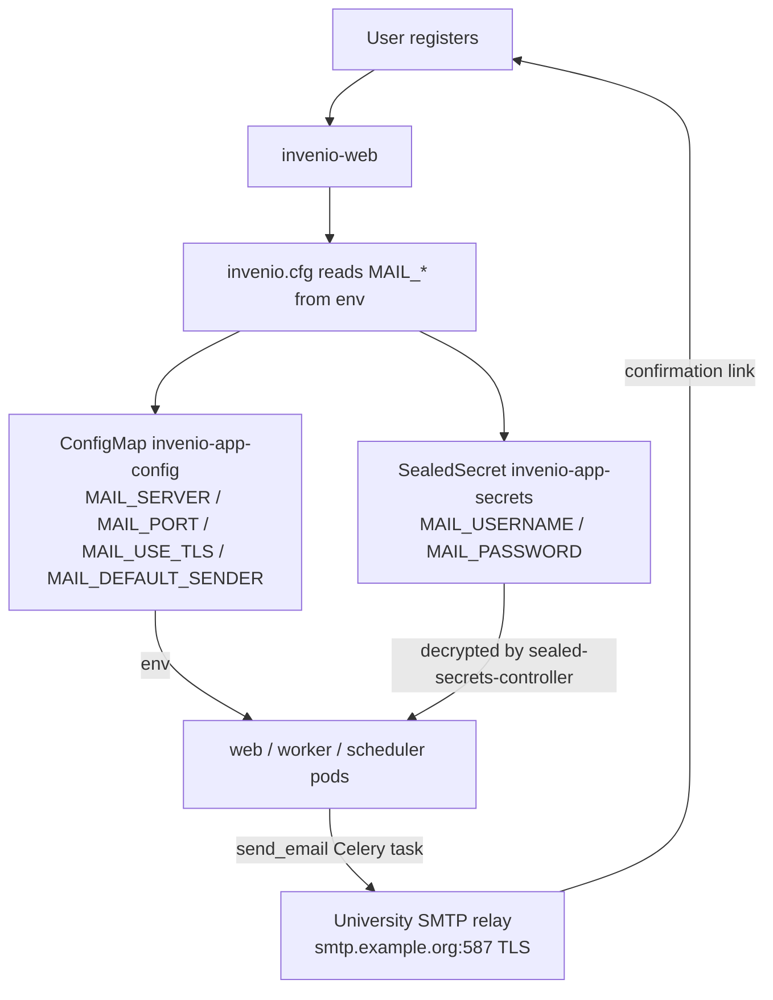

# Email Confirmation / SMTP Mail Configuration — Implementation Plan

> **Issue:** #67 (T2) — Wire SMTP mail configuration with placeholder credentials.
> **Branch:** `feat/67-mail-config` (merged #69) + `fix/71-image-digest-bump` (merged #72)
> **Status:** **DEPLOYED + VERIFIED 2026-09-02** — plumbing live in cluster (ConfigMap + SealedSecret + mail-enabled image `0f685be` rolled to web/worker/scheduler; `MAIL_*` env confirmed in running pods). Remaining: operator supplies university SMTP relay credentials (re-seal `MAIL_USERNAME`/`MAIL_PASSWORD` per Operator steps below).

## Why

Registration requires email confirmation (`SECURITY_CONFIRMABLE = True`,
`SECURITY_LOGIN_WITHOUT_CONFIRMATION = False` in `docker/ugm/invenio.cfg`), but
**no mail server is configured anywhere** in the GitOps stack:

- No `MAIL_*` settings in `docker/ugm/invenio.cfg` → Flask-Mail falls back to
  `localhost:25` with no auth.
- No mail vars in the `invenio-app-config` ConfigMap.
- No `MAIL_USERNAME`/`MAIL_PASSWORD` in the `invenio-app-secrets` SealedSecret.
- No SMTP service in the cluster.

Consequence: confirmation emails never send → newly registered users can never
confirm their email → they can never log in. The operator will supply university
SMTP relay credentials later; this wave delivers the complete plumbing with
placeholder values so the only remaining step is sealing real credentials.

## Goals

| # | Goal | Why |
|---|---|---|
| 1 | Read all Flask-Mail settings from env vars in `invenio.cfg` | Same file works for local dev and cluster; ConfigMap/SealedSecret control runtime |
| 2 | Provide non-secret mail config (server, port, TLS, sender) via ConfigMap | Operator replaces one placeholder host when creds arrive |
| 3 | Provide `MAIL_USERNAME`/`MAIL_PASSWORD` via the existing SealedSecret | Credentials stay encrypted in git, never plaintext |
| 4 | Document the exact kubeseal recipe + verification steps | Operator can finish in minutes without spelunking |

## Architecture



**Key principle:** credentials live only in the SealedSecret (encrypted in git);
everything else is plain ConfigMap/env wiring. Replacing the placeholder relay
requires exactly two edits: the ConfigMap host and a re-sealed secret.

## Files Overview

| File | Type | Description |
|---|---|---|
| `docker/ugm/invenio.cfg` | Modified | Mail section: 8 `MAIL_*`/`SECURITY_EMAIL_SENDER` settings read from env with localhost defaults |
| `k8s/apps/invenio/app-config.yaml` | Modified | `MAIL_SERVER` (placeholder `smtp.example.org`), `MAIL_PORT: 587`, `MAIL_USE_TLS: true`, `MAIL_DEFAULT_SENDER: noreply@invenio.vityasy.me` |
| `k8s/apps/invenio/app-sealed-secret.yaml` | Modified | `MAIL_USERNAME`/`MAIL_PASSWORD` placeholder values sealed with kubeseal (strict scope, matches existing entries) |
| `docs/plans/active/2026-09-02-email-confirmation.md` | New | This plan |
| `docs/cluster-assessment-2026-09-02.md` | New | Cluster drift assessment for this wave |
| `docs/plans/README.md` | Modified | Index entry for this plan |

## Task Groups

- [x] **Group 1 — invenio.cfg**: add Mail section (env-driven, localhost defaults)
- [x] **Group 2 — ConfigMap**: add non-secret mail vars with placeholder values
- [x] **Group 3 — SealedSecret**: seal placeholder `MAIL_USERNAME`/`MAIL_PASSWORD`
- [x] **Group 4 — Docs**: plan doc, cluster assessment, plans index
- [x] **Group 5 — Verify**: kustomize render, yamllint, grep checks, no plaintext creds

## Acceptance Criteria

- [x] `grep MAIL_ docker/ugm/invenio.cfg` shows all 8 settings read from env
- [x] ConfigMap has `MAIL_SERVER`/`MAIL_PORT`/`MAIL_USE_TLS`/`MAIL_DEFAULT_SENDER`
- [x] SealedSecret has `MAIL_USERNAME`/`MAIL_PASSWORD` (sealed, no plaintext)
- [x] `kustomize build k8s/apps/invenio` renders cleanly
- [x] `yamllint` passes on modified YAML
- [x] No plaintext credentials anywhere in the diff

## Operator Steps (when university SMTP relay credentials arrive)

The existing SealedSecret entries carry **no `spec.scope`** field, i.e. they were
sealed with kubeseal's default **strict** scope (name + namespace must match:
`invenio-app-secrets` in `invenio`). Re-seal with the same scope.

1. **Seal the new credentials** (run from the repo root, on VPN or with the
   controller public key cached locally):

   ```bash
   # Option A — online (controller reachable):
   kubectl create secret generic invenio-app-secrets \
     --namespace invenio \
     --from-literal=MAIL_USERNAME='<university-relay-username>' \
     --from-literal=MAIL_PASSWORD='<university-relay-password>' \
     --dry-run=client -o yaml |
     kubeseal --controller-namespace kube-system \
       --controller-name sealed-secrets-controller \
       --format yaml --namespace invenio --name invenio-app-secrets

   # Option B — offline (no cluster access; key cached at ~/.sealed-secrets/):
   kubectl create secret generic invenio-app-secrets \
     --namespace invenio \
     --from-literal=MAIL_USERNAME='<university-relay-username>' \
     --from-literal=MAIL_PASSWORD='<university-relay-password>' \
     --dry-run=client -o yaml |
     kubeseal --cert ~/.sealed-secrets/sealed-secrets-public.pem \
       --format yaml --namespace invenio --name invenio-app-secrets
   ```

   Copy the two `MAIL_*` lines from the output into
   `k8s/apps/invenio/app-sealed-secret.yaml` (replacing the placeholder entries),
   keeping the existing `spec.template` block untouched.

2. **Replace the placeholder relay host** in `k8s/apps/invenio/app-config.yaml`:
   `MAIL_SERVER: "smtp.example.org"` → the real university relay host (keep
   `MAIL_PORT: "587"` and `MAIL_USE_TLS: "true"` unless the relay says otherwise).

3. **Commit + push** (ArgoCD auto-syncs from `main`; the image does NOT need a
   rebuild — `k8s/` changes don't trigger `build-image.yaml`):

   ```bash
   git add k8s/apps/invenio/app-config.yaml k8s/apps/invenio/app-sealed-secret.yaml
   git commit -m "feat: configure university SMTP relay credentials (#67)"
   git push
   ```

4. **Verify the seal decrypts** before declaring done (stale seals silently block
   pulls — see CONVENTIONS.md): `kubectl get secret invenio-app-secrets -n invenio -o jsonpath='{.data.MAIL_USERNAME}' | base64 -d` should show the new username.

## Verification Steps (post-deploy)

1. **Register a user** at https://invenio.vityasy.me — the UI should show
   "confirmation email sent" instead of silently failing.
2. **Watch the worker logs** for the `send_email` Celery task:
   `kubectl logs -n invenio deploy/invenio-worker -f | grep -i "send_email\|smtp\|mail"`.
   A successful send logs the task as `succeeded`; a failure logs the SMTP error
   (e.g. `ConnectionRefusedError` or `SMTPAuthenticationError`).
3. **Check the SMTP relay** accepts the credentials (operator-side): confirm the
   confirmation email arrives in the test inbox and the link works.
4. **Log in** with the confirmed account — previously impossible without a
   working relay.
