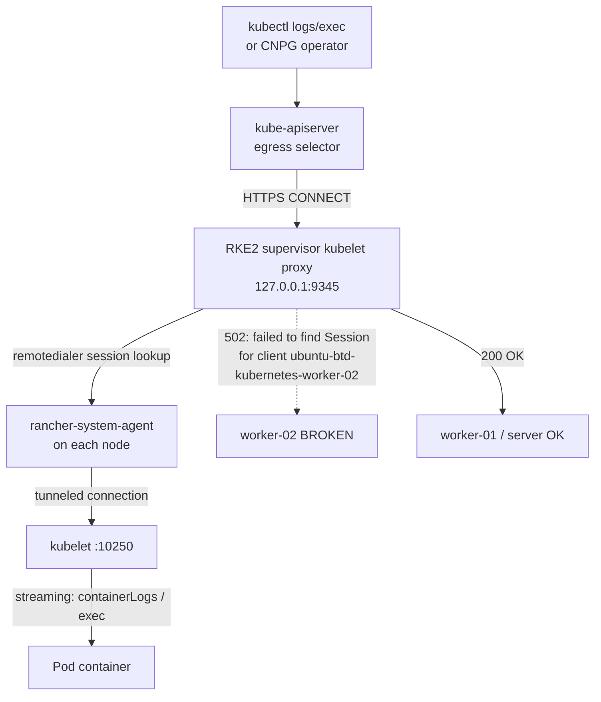

# Kubelet Streaming-Proxy 502 (Rancher agent ↔ kubelet) — Diagnosis & Remediation Plan

> **Issue:** #75 (T3) — All CNPG backups fail since 2026-06-04 with
> `error dialing backend: proxy error from 127.0.0.1:9345 while dialing <node-ip>:10250, code 502`.
> **Branch:** `fix/75-proxy-502`
> **Status:** **DIAGNOSED 2026-09-03** — root cause identified at the RKE2 supervisor
> kubelet-proxy boundary. Remediation commands prepared below; **lead executes with
> user approval** (no cluster mutations performed during diagnosis).

## Why

Every CNPG backup since 2026-06-04 fails with:

```
can't execute backup: cmd: [/controller/manager backup postgres-daily-backup-...]
error: error dialing backend: proxy error from 127.0.0.1:9345 while dialing 10.17.117.43:10250, code 502: 502 Bad Gateway
```

The CNPG operator (`invenio-postgresql-cloudnative-pg-*`, on worker-02) execs into
postgres pods to run `pg_basebackup`/barman. That exec goes through the kube-apiserver
egress selector → RKE2 supervisor kubelet proxy (`127.0.0.1:9345`) → kubelet
(`:10250`). The proxy returns **502**, so backups have failed for **90 days**
(1,872 failed Backup objects as of 2026-09-03). `kubectl logs`/`exec` to pods on
worker-02 fail intermittently with the same 502; worker-01 and the server node work.

## Goals

| # | Goal | Why |
|---|---|---|
| 1 | Restore kubelet streaming (logs/exec) to worker-02 | CNPG backups exec into postgres pods on worker-02; without it backups can never complete |
| 2 | Verify worker-01 streaming stays healthy | Regression guard — worker-01 currently works |
| 3 | Confirm a CNPG backup completes end-to-end | The actual user-visible outcome (90-day outage) |
| 4 | Document the exact remediation + verification commands | Lead executes with user approval; no guessing |

## Architecture



**Key principle:** the 502 is **not** a kubelet problem — worker-02's kubelet is
reachable and TLS-valid. The failure is the supervisor proxy's remotedialer session
table: it has no session registered for `ubuntu-btd-kubernetes-worker-02`, so the
CONNECT is rejected before any traffic reaches the kubelet.

## Evidence (gathered 2026-09-02/03, read-only)

### Boundary 1 — kubectl streaming to pods (user-visible symptom)

| Test | Result |
|---|---|
| `kubectl -n invenio logs invenio-web-f64d84446-4hhl4 --tail=5` (worker-01) | **OK** (uwsgi logs) |
| `kubectl -n invenio exec invenio-web-f64d84446-4hhl4 -- echo ok` (worker-01) | **OK** |
| `kubectl -n invenio logs invenio-web-f64d84446-mf5n6 --tail=5` (worker-02) | **502** ×2 attempts |
| `kubectl -n invenio exec invenio-web-f64d84446-mf5n6 -- echo ok` (worker-02) | **502** |
| `kubectl -n database logs postgres-1/2/3` (worker-02) | **502** (all) |
| `kubectl -n database logs invenio-postgresql-cloudnative-pg-*` (worker-02) | **502** |
| `kubectl -n cattle-fleet-system logs fleet-agent-0` (worker-02) | **502** |
| `kubectl -n cattle-system exec rancher-webhook-* -- echo ok` (server node) | **OK** |
| `kubectl get --raw /api/v1/nodes/.../proxy/healthz` worker-02 | **502**; worker-01 `ok` |

### Boundary 2 — kubelet reachability (direct, bypassing the proxy)

| Test | Result |
|---|---|
| `curl -sk https://10.17.117.43:10250/healthz` from cluster-agent pod (server node) | **401** (reachable, auth expected) |
| Same from kube-proxy pod on server node (host network) | **401** |
| Same from kube-proxy pod on worker-01 (host network) | **401** |
| `curl -sk .../containerLogs/...` and `/pods` on worker-02 | **401** (reachable) |
| TLS cert `10.17.117.43:10250` | CN=ubuntu-btd-kubernetes-worker-02, valid to 2027-07-17, SANs include 10.17.117.43 |

**Conclusion:** worker-02 kubelet is TCP+TLS reachable from both pod and host
networks. The 502 is upstream of the kubelet.

### Boundary 3 — the supervisor kubelet proxy (127.0.0.1:9345) — ROOT CAUSE

Reproduced the exact egress path from inside `kube-apiserver-ubuntu-btd-kubernetes-server`
(egress selector config: `proxyProtocol: HTTPConnect`, `url: https://127.0.0.1:9345`,
client cert = `client-kube-apiserver.crt`):

```
CONNECT 10.17.117.42:10250  →  HTTP/1.1 200 OK            (worker-01: tunnel established)
CONNECT 10.17.117.41:10250  →  HTTP/1.1 200 OK            (server node: tunnel established)
CONNECT 10.17.117.43:10250  →  HTTP/1.1 502 Bad Gateway
  {"kind":"Status","status":"Failure",
   "message":"failed to find Session for client ubuntu-btd-kubernetes-worker-02",
   "reason":"InternalError","code":502}
```

The supervisor's remotedialer session table has **no session for worker-02**.
worker-01 and the server node have live sessions. This is the exact error string
seen in every CNPG backup failure since 2026-06-04.

### Boundary 4 — Rancher agent state

- `cattle-cluster-agent` Deployment (2 replicas, `rancher/rancher-agent:v2.12.3`,
  `CATTLE_SERVER=https://10.17.104.130`, `CATTLE_SERVER_VERSION=v2.12.3`) — both pods
  Running on the **server node**; 8–9 restarts (last 41h ago).
- **No `cattle-node-agent` DaemonSet exists** — this is an RKE2 cluster; per-node
  agents are host-level `rancher-system-agent` processes (not pods), so there is
  nothing to restart in-cluster for worker-02's agent.
- Agent logs show repeated `Remotedialer proxy error: dial tcp 10.17.104.130:443:
  connect: connection refused` + `websocket: close 1006` — the cluster agent's
  websocket to the Rancher server flaps (Rancher server reachability from the
  cluster is intermittent; the tunnel reconnects, but worker-02's session is not
  re-registered).
- `clusters.management.cattle.io local`: `Ready=True`, `Connected=True` (stale —
  lastUpdateTime 2025-07-11).
- Node conditions: all three nodes `Ready=True`, heartbeats fresh (2026-09-02T17:3xZ).
- Node annotations: worker-01 and worker-02 share the **same `machineID`
  (`de88ca16f84640b7945405d6ab517fc3`)** — worker-01 (15d old) is a VM clone of
  worker-02. Both run `rke2 agent --server https://10.17.117.41:9345`.
- `agent-tls-mode` setting: default `strict`, value empty (i.e. strict).

### Boundary 5 — CNPG impact

- `scheduledbackup/postgres-daily-backup`: `schedule: 0 2 * * *`, last backup 12d ago
  (all since 2026-06-04 failed).
- 1,872 Backup objects in `failed` phase; error string identical to the 502 above.
- `postgres-1` (worker-02) and `postgres-2` (worker-01) are crash-looping on
  **startup probe** (`HTTP probe failed with statuscode: 500`, 445/368 restarts) —
  separate issue from the 502 (probe is pod-local, not streaming), but it means the
  cluster is degraded; `postgres-3` (worker-02) is Ready.

## Root-Cause Statement

**The RKE2 supervisor kubelet proxy (`127.0.0.1:9345`) has no remotedialer session
for `ubuntu-btd-kubernetes-worker-02`** (`failed to find Session for client
ubuntu-btd-kubernetes-worker-02`). The per-node `rancher-system-agent` on worker-02
is not (or no longer) registered in the supervisor's tunnel session table, so every
kubelet streaming request (logs/exec/proxy) to worker-02 is rejected with 502 before
reaching the kubelet. The kubelet itself is healthy and reachable. The trigger
window aligns with the 2026-06-04 backup outage start; the cluster agent's flapping
websocket to `10.17.104.130:443` (connection refused / close 1006) is the likely
catalyst that dropped worker-02's session without re-registration.

## Files Overview

| File | Type | Description |
|---|---|---|
| `docs/plans/active/2026-09-02-proxy-502.md` | New | This plan (diagnosis + remediation) |
| `docs/plans/README.md` | Modified | Index entry for this plan |
| `WORKER-REPORT.md` | New | Worker output contract (findings, prepared commands, approvals needed) |

No k8s manifest changes — the fix is operational (agent restart / node re-registration),
not declarative. If a manifest-level fix is later warranted (e.g. `agent-tls-mode`
setting), it will be a follow-up PR.

## Task Groups

- [x] **Group 1 — Diagnosis (read-only)**: streaming tests, kubelet reachability,
      supervisor proxy CONNECT tests, agent logs/config, CNPG impact (this doc)
- [ ] **Group 2 — Remediation (lead executes with approval)**: restart cluster agent,
      re-register worker-02 agent session, verify streaming
- [ ] **Group 3 — Verification**: logs/exec ×3 on both workers, CNPG backup completes
- [ ] **Group 4 — Docs**: plan status update + index (this PR)

## Acceptance Criteria

- [ ] `kubectl -n invenio logs invenio-web-f64d84446-mf5n6 --tail=5` succeeds ×3
- [ ] `kubectl -n invenio exec invenio-web-f64d84446-mf5n6 -- echo ok` succeeds ×3
- [ ] `kubectl -n invenio logs invenio-web-f64d84446-4hhl4 --tail=5` still succeeds (worker-01 regression)
- [ ] `kubectl get --raw /api/v1/nodes/ubuntu-btd-kubernetes-worker-02/proxy/healthz` returns `ok`
- [ ] A CNPG backup completes: `kubectl -n database get backups | tail` shows a
      `completed` phase (or `kubectl -n database create job --from=cronjob/...` /
      manual `Backup` object per CNPG docs)
- [ ] No cluster mutations performed during diagnosis (docs-only commit)

## Execution Steps (lead executes with approval)

> All commands below are **mutating** — run only after user approval. Read-only
> verification commands are marked `[RO]`.

### Step 0 — Pre-flight (read-only)

```bash
# [RO] Confirm current state before touching anything
kubectl -n invenio logs invenio-web-f64d84446-mf5n6 --tail=5          # expect 502
kubectl get --raw /api/v1/nodes/ubuntu-btd-kubernetes-worker-02/proxy/healthz   # expect 502
kubectl -n cattle-system get deploy cattle-cluster-agent -o wide
```

### Step 1 — Restart the Rancher cluster agent (in-cluster, safe)

The cluster agent is the remotedialer client that registers node sessions with the
supervisor proxy. Restarting it forces re-registration of all node sessions.

```bash
kubectl -n cattle-system rollout restart deploy/cattle-cluster-agent
kubectl -n cattle-system rollout status deploy/cattle-cluster-agent --timeout=180s
```

Wait 60–120s for the websocket to `wss://10.17.104.130/v3/connect` to reconnect and
sessions to re-register.

### Step 2 — Verify streaming to worker-02 (read-only)

```bash
# [RO] ×3 attempts each
kubectl -n invenio logs invenio-web-f64d84446-mf5n6 --tail=5
kubectl -n invenio exec invenio-web-f64d84446-mf5n6 -- echo ok
kubectl get --raw /api/v1/nodes/ubuntu-btd-kubernetes-worker-02/proxy/healthz
```

If all succeed → proceed to Step 4 (CNPG backup verification).

### Step 3 — If worker-02 still 502s: re-register the node agent (host-level)

The per-node agent on worker-02 is the host-level `rancher-system-agent` (no
DaemonSet pod exists to restart). Re-registration requires SSH to the node
(credentials are NOT in this repo — user must supply access):

```bash
# On worker-02 (10.17.117.43), as root:
systemctl status rancher-system-agent          # confirm service exists/running
systemctl restart rancher-system-agent        # reconnects websocket + re-registers session
journalctl -u rancher-system-agent --since "10 minutes ago" | tail -50   # confirm "Connected to proxy"
```

If SSH is unavailable, the Rancher UI path is: **Cluster → ubuntu-btd-kubernetes-worker-02
→ Edit Config → Save** (forces agent re-registration), or **Cluster → Nodes → worker-02 →
⋮ → Edit → Save**. See escalation section.

### Step 4 — Verify a CNPG backup completes (read-only trigger + watch)

```bash
# [RO] Watch the next scheduled backup (02:00 daily) or trigger manually:
kubectl -n database get scheduledbackup postgres-daily-backup
# Manual trigger (creates a Backup object; CNPG runs it):
kubectl -n database create job --from=cronjob/...   # only if a CronJob exists; otherwise:
#   kubectl -n database apply -f - <<'EOF'
#   apiVersion: postgresql.cnpg.io/v1
#   kind: Backup
#   metadata:
#     name: manual-verify-$(date +%Y%m%d%H%M)
#     namespace: database
#   spec:
#     cluster:
#       name: postgres
#   EOF
kubectl -n database get backups --sort-by=.metadata.creationTimestamp | tail -3
# Expect: PHASE=completed (was failed for 90 days)
```

### Step 5 — Regression check (read-only)

```bash
# [RO] worker-01 + server node must still stream
kubectl -n invenio logs invenio-web-f64d84446-4hhl4 --tail=5
kubectl -n cattle-system exec rancher-webhook-6f4d8f9897-nl4h7 -- echo ok
kubectl get --raw /api/v1/nodes/ubuntu-btd-kubernetes-worker-01/proxy/healthz
```

## If Fix Doesn't Work (escalation)

1. **Rancher UI access is required** — the kubeconfig token is cluster-scoped and
   cannot query the Rancher management API (`/v3/nodes` returns 401). The lead/user
   must log into the Rancher UI at `https://10.17.104.130` (or the public Rancher
   URL) and check:
   - **Cluster → Nodes**: is worker-02 listed with a healthy agent state? Any
     "Agent disconnected" / "Not registered" indicator?
   - **Cluster → worker-02 → Edit Config → Save**: forces agent re-registration.
   - **Global → Cluster Management → btd-rke2 → ⋮ → View in API**: inspect
     `/v3/clusters/c-m-vrpr6n7h/nodes` for worker-02's `agentConnected` field.
2. **SSH to worker-02** (user supplies credentials): `systemctl restart
   rancher-system-agent`; check `journalctl -u rancher-system-agent` for
   `Connected to proxy`; verify `ss -tnp | grep 9345` shows the agent listening.
3. **Check Rancher server reachability from the cluster**: the agent logs show
   `dial tcp 10.17.104.130:443: connect: connection refused` — if the Rancher
   server itself is flapping, fix that first (it is the tunnel endpoint).
4. **Known RKE2/Rancher patterns to rule out** (all checked during diagnosis):
   - Agent version mismatch: cluster agent `v2.12.3` matches `server-version v2.12.3` ✓
   - Kubelet bind address / certs: valid, SANs correct ✓
   - TLS cert rotation: kubelet certs valid to 2027 ✓
   - Agent restart loops: cluster agent restarted 8–9× (41h ago) but is Running ✓
   - Duplicate `machineID` (worker-01 is a VM clone of worker-02): if re-registration
     fails, verify worker-02's `/etc/machine-id` is unique — a duplicate machine-id
     can confuse agent identity/session registration.

## Rollback Plan

- Step 1 (cluster-agent restart) is a standard rolling restart of a Deployment with
  `maxUnavailable: 0` — no rollback needed; if the cluster agent fails to come back,
  `kubectl -n cattle-system rollout undo deploy/cattle-cluster-agent`.
- Step 3 (host-level `systemctl restart rancher-system-agent`) is idempotent; the
  service restarts and reconnects. No data risk.
- No manifests are changed by this plan, so there is nothing to revert in git.

## Affected Services

- CNPG backups (`database/postgres` cluster, `postgres-daily-backup` ScheduledBackup)
- `kubectl logs`/`exec`/`port-forward` to any pod on `ubuntu-btd-kubernetes-worker-02`
- Rancher UI pod logs/exec for worker-02 pods
