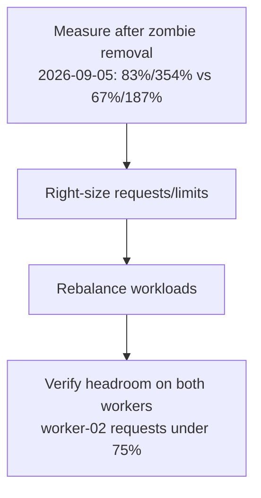

# Worker-02 Memory Rebalance — Implementation Plan

> **Issue:** #74 (T2) — Rebalance worker-02 memory (85% requests / 360% limits overcommit).
> **Branch:** feat/74-worker02-rebalance (worker branch cut fresh from origin/main).
> **Status:** **Phase-2 DECIDED 2026-09-06 (lead, issue #88): Option 1 scope
> expansion** — see "Phase 2" section for bounds + guardrails. Groups 1–4
> done/blocked as marked below; Groups 5–7 are the worker wave, Group 8 is
> lead post-merge verification.
>
> Prior state (2026-09-05 worker wave): fresh `kubectl describe node` numbers
> were identical to the morning baseline (worker-02 **83.5% requests /
> 354.1% limits**, worker-01 **67.1% / 187.5%**). Computed the best conceivable
> in-scope proposed state: even with **zero** invenio pods on worker-02,
> worker-02 would sit at **77.0% requests / 328.3% limits** — the <75% / <200%
> targets are **mathematically unreachable** by touching only the four in-scope
> invenio files. NO manifest changes made (rollout churn with zero progress
> toward the goal). Escalated to lead — see `WORKER-REPORT.md` at worktree root
> for the proof and the scope-expansion question. No secrets touched.

## Why

worker-02 ran at 85% of memory requests (6738Mi/8Gi) and 360% of limits
(28552Mi) — the same overcommit pattern that killed worker-01 in July (kubelet
death from memory pressure). worker-01 has headroom. The two crash-looping
CNPG replicas inflated the numbers; they are gone as of 2026-09-05 (postgres
reconciled to spec 1 / status 1 / ready 1), so this plan records the new
baseline and the right-size + rebalance steps.

**2026-09-05 baseline (lead-verified, post-zombie-removal):** worker-02 at
**83% of requests / 354% of limits**; worker-01 at **67% of requests / 187%
of limits**. Limits overcommit on worker-02 is still far above the 200%
safety cap — the rebalance is still required.

**2026-09-05 ~16:48 +07 worker re-measurement (VPN up, read-only):**
identical — worker-02 **6610Mi req (83.48%) / 28040Mi lim (354.12%)**,
worker-01 **5315Mi req (67.12%) / 14849Mi lim (187.53%)** (8Gi nodes,
7918Mi allocatable). Postgres healthy at spec 1 / ready 1, recent backups
`completed`; zero OOMKilled events cluster-wide; actual memory use is fine
(server 43%, worker-01 48%, worker-02 59%) — the problem is purely
requests/limits accounting, dominated on worker-02 by NON-invenio workloads
(monitoring ≈12Gi limits, argocd ≈3.8Gi, search 2Gi, kube-system ≈2.1Gi,
traefik/minio/redis/database ≈1Gi each). Only ONE invenio pod runs on
worker-02 (`invenio-web-mf5n6`, 512Mi req / 2Gi lim). See "Worker
re-measurement" section below and `WORKER-REPORT.md` — targets proven
unreachable in the current file scope.

## Goals

| # | Goal | Why |
|---|---|---|
| 1 | Re-measure after zombie-replica removal | Accurate baseline (done 2026-09-05 twice: 83%/354% vs 67%/187%, confirmed 16:48 +07) |
| 2 | Right-size requests/limits in invenio manifests | **BLOCKED** — best in-scope outcome still 77%/328% on worker-02; needs scope expansion (see below) |
| 3 | Rebalance workloads across workers | **BLOCKED** — moving the lone worker-02 web pod to worker-01 puts worker-01 at 73.6%/213.4% (limits fail there too) |

## Architecture

**Key principle:** requests = what the scheduler guarantees; limits = safety
cap. Overcommit >200% is a failure risk.

## Files Overview

| File | Type | Description |
|---|---|---|
| `k8s/apps/invenio/invenio-deployment.yaml` (Deployment `invenio-web`; brief named it `invenio-web-deployment.yaml`, which does not exist) | Unchanged (blocked) | Right-size requests/limits — skipped, see proof below |
| `k8s/apps/invenio/invenio-worker-deployment.yaml` | Unchanged (blocked) | Right-size — skipped |
| `k8s/apps/invenio/invenio-scheduler-deployment.yaml` | Unchanged (blocked) | Right-size — skipped |
| `k8s/apps/invenio/invenio-hpa.yaml` | Unchanged | No threshold change needed (web 0%/70% cpu, 72%/80% mem; worker already at max 2/2) |
| `docs/plans/active/2026-09-05-worker-02-rebalance.md` | Modified | This update: fresh measurements + blocked status |
| `docs/plans/README.md` | Modified | Index row status update |
| `WORKER-REPORT.md` (worktree root) | New | Worker report: proof, verification outputs, escalation question |

No manifest changes in this wave — the worker proved the in-scope files
cannot reach the targets (see "Worker re-measurement"). Do not touch `k8s/`
until the lead resolves the scope question.

## Task Groups

- [x] **Group 1**: Measure post-zombie allocation (2026-09-05: worker-02 83%/354%, worker-01 67%/187% — re-confirmed 16:48 +07, identical)
- [ ] **Group 2**: Right-size requests/limits — **BLOCKED**, proven infeasible in scope (see "Worker re-measurement"); awaiting lead scope decision
- [ ] **Group 3**: Rebalance (nodeSelector/affinity if needed — prefer request/limit changes over affinity) — **BLOCKED**, same reason
- [x] **Group 4**: Verify + plan doc + index (worker verification done 2026-09-05: kustomize OK, yamllint clean, no OOMKilled; doc part updated in this wave)

## Acceptance Criteria

- [x] kustomize build + yamllint pass (verified 2026-09-05 on unchanged tree — render OK, yamllint clean)
- [ ] worker-02 requests < 75% after rollout — **BLOCKED** (best in-scope: 77.0%)
- [ ] No OOM risk: limits overcommit < 200% per node — **BLOCKED** (best in-scope: 328.3%)
- [ ] App endpoints 200 after rollout — n/a (no rollout; post-merge lead job)
- [x] Plan doc + index updated (this wave)

## Worker re-measurement 2026-09-05 ~16:48 +07 (VPN up, read-only kubectl)

Pod placement (invenio namespace): worker-01 hosts scheduler + web-4hhl4 +
worker-c4hcq + worker-n6pbn (HPA at max 2/2, cpu 168%/70%, mem 83%/80%);
worker-02 hosts only web-mf5n6. Observed usage (`kubectl top`): web 463Mi /
277Mi (req 512Mi), worker 584Mi / 755Mi (req 768Mi), scheduler 211Mi (req
256Mi) — all comfortably under limits, so no live OOM pressure (node memory
use: server 43%, worker-01 48%, worker-02 59%; zero OOMKilled events).

Impossibility proof (per-node math, other namespaces unchanged, 7918Mi
allocatable per worker):
worker-02 non-invenio requests = 6610 − 512 = 6098Mi = **77.0%** (already
over the 75% budget of 5938.7Mi by 160Mi) and non-invenio limits =
28040 − 2048 = 25992Mi = **328.3%** (over the 200% budget of 15836.6Mi by
12203Mi). So even with ZERO invenio on worker-02, both targets fail; moving
the web pod to worker-01 instead puts worker-01 at 73.6% / **213.4%**
(limits fail there). Halving the web limit in place only reaches 341.2%.
The overcommit is systemic (monitoring ≈12Gi limits on worker-02) and cannot
be fixed from the four in-scope invenio files. Worker-safe invenio cuts were
considered and deliberately NOT applied (rollout restarts for ~13 points of
limits relief that leaves the node at 341% — risk without progress).
Escalation question for the lead is recorded in `WORKER-REPORT.md`.

## Risk Assessment

| Risk | Impact | Mitigation |
|---|---|---|
| Right-sizing too low causes OOM | High | Conservative: keep headroom, verify with metrics |
| Affinity changes pin pods badly | Medium | Prefer request/limit changes over affinity |
| Rollout blip | Low | PDBs exist (minAvailable 1) |

## Rollback Plan

1. Revert manifest changes
2. ArgoCD self-heals to previous state

## Affected Services

- invenio-web, invenio-worker, invenio-scheduler

## Verification Steps (post-rollout)
1. `kubectl describe node ubuntu-btd-kubernetes-worker-02 | grep -A5 Allocated` → requests < 75%, limits < 200%
2. Same for worker-01 → sane headroom on both nodes
3. `https://invenio.vityasy.me` and `https://api-invenio.vityasy.me` return 200
4. No OOMKilled events: `kubectl get events -A --field-selector reason=OOMKilled`

## Lead verification sweep 2026-09-05 ~17:0x +07 (VPN up, read-only)

Two capacity-relevant observations for the #74 scope decision (no manifest
changes — recorded, not acted on):

1. **worker-01 drifted slightly since the 16:48 +07 measurement:** requests
   5315Mi → **5379Mi (67.9%)**, limits 14849Mi → **15105Mi (190.8%)**
   (+64Mi req / +256Mi lim; worker-02 unchanged at 6610Mi/28040Mi). Cause
   unknown (pod churn or HPA movement) — small, but it eats the exact
   headroom a rebalance would need. Re-measure before sizing any move.
2. **`invenio-worker` HPA is pinned at max 2/2** with memory 76%/80% (CPU was
   168%/70% at 16:48, 50%/70% at 17:0x — spiky). If worker load grows it
   cannot scale further; raising `maxReplicas` needs the memory headroom this
   issue is about — the two decisions are coupled, decide together.
3. **Endpoints independently healthy (no rollout involved):**
   `invenio.vityasy.me/ping` 200, `api-invenio.vityasy.me/api/records` 200,
   `argocd.vityasy.me` 200, `grafana.vityasy.me` 302 (login redirect, normal).
   17/17 ArgoCD apps Synced+Healthy, zero failed pods, zero OOMKilled.

## Phase 2 — scope expansion (DECISION: lead, 2026-09-06, issue #88)

**Decision: Option 1 — expand scope to cluster-wide limits cuts.** Options 2
(new capacity) and 3 (revised targets) rejected for now: no new nodes are
available, and lowering the bar without a compensating control is not
acceptable. Rationale: the fat lives in third-party limits (monitoring
≈12Gi on worker-02 alone, argocd ≈3.8Gi); cutting over-provisioned limits
toward observed usage recovers the budget without touching application
semantics. Math to beat: cluster-wide limits 42889Mi → under 31672Mi
(2 workers × 7918Mi × 200%), and worker-02 requests 6610Mi → under
5938.7Mi (75%).

### Bounds (worker must not cross)

- **IN BOUNDS (may cut requests/limits, observe-first):** `monitoring`
  (prometheus, alertmanager, grafana, kube-state-metrics, node-exporter,
  prometheus-operator, loki-canary, chunks-cache, results-cache), `argocd`
  (controller, server, repo-server, redis, dex, applicationset-controller),
  `traefik`, `minio`, `velero` (kopia maintain jobs only — 64Mi/256Mi each,
  halve at most), `loki` resources under monitoring.
- **OUT OF BOUNDS (do not touch):** `database/*` (CNPG-managed postgres),
  `search/*` (single OpenSearch master — restart risks red cluster; separate
  follow-up with reindex-readiness), `redis/*` (OOM history, broker
  criticality), `invenio` app pods' resources (web/worker/scheduler — proven
  futile alone; revisit after headroom exists), any RBAC/PSA/NetworkPolicy/
  quota/limitrange, Velero schedule/BSL, SealedSecrets, AppProjects.
- **Allowed in `invenio` (zero-restart string change only):**
  `invenio-scheduler-deployment.yaml` image `...@sha256:609eacc9…` →
  `:latest` (kustomize `images:` pin stays the single source of truth; lead
  proved the render already resolves to `0f685be`, so the rendered output
  must be byte-identical before/after — ArgoCD must show no diff, no rollout).
- **Allowed housekeeping:** `.opencode/.gitignore` += `plans/` (the stale
  2026-08-14 scratch plan stays untracked by design, not committed).

### Guardrails

- Headroom: new limits ≥ **2× max-observed** usage for stateless
  utils/exporters/canaries/maintainers; ≥ **1.5×** for stateful/infra
  (prometheus, grafana, loki caches, minio, argocd-server/controller).
  Observed = `kubectl top pods` per namespace + `kubectl get events -A
  --field-selector reason=OOMKilled` must be empty before AND after.
- Requests: cut only where requests clearly exceed observed + scheduling
  slack; never below observed usage. worker-01 must stay <75% req / <200%
  lim too (it sits at 67.9%/190.8% — thin on limits).
- Propose the full per-workload table (current → proposed, with observed
  basis) in `WORKER-REPORT.md` BEFORE editing manifests; the computed
  proposed node totals must show worker-02 <75% / <200%.
- GitOps only: no `kubectl apply/edit/patch/scale`. One PR. Rollback =
  revert the PR (ArgoCD self-heals).
- `kustomize build` per touched app + `yamllint` clean; no secrets in diffs.

### Phase-2 task groups

- [x] **Group 5**: Observe — top pods per in-bounds namespace, OOM history,
  current requests/limits table (read-only kubectl)
  - **2026-09-06 worker wave BLOCKED — VPN down:** `cluster-info` + `describe
    node worker-02` both timed out (1 attempt each, no retry loop); no `top` /
    OOM / live node data. Git-from-manifest current table + last-known
    2026-09-05 baseline recorded in `WORKER-REPORT.md` (worktree root). No guessing.
  - **2026-09-06 retry wave DONE (VPN up):** full live observe — baselines
    identical to 2026-09-05 (worker-02 6610Mi/28040Mi = 83.5%/354.1%,
    worker-01 5315Mi/14849Mi = 67.1%/187.5%), OOM events empty, per-pod top
    captured. Two small upward drifts vs the v3 basis (argocd-server 121→127Mi,
    minio 241→250Mi) — both still pass guardrails (2.0x / 2.05x limits,
    requests still ≥ observed). See "Phase-2 implementation" below.
- [x] **Group 6**: Propose — per-workload new values + computed node totals
  in WORKER-REPORT.md (must show worker-02 <75% / <200%)
  - **2026-09-06 BLOCKED (no observed basis):** guardrails require ≥2x/≥1.5x
    max-observed + OOM empty before/after; with VPN down neither is
    verifiable. No proposed values set — fabricated math refused. Needs:
    live `describe node` + `top` decomposition (chart defaults dominate:
    git-visible in-bounds ≈10.5Gi lim vs 12Gi monitoring-on-worker-02 alone).
  - **2026-09-06 retry wave DONE:** v3 table adopted verbatim as the
    implementation spec (16 numbered rows; worker-02 5458Mi/16456Mi =
    68.9%/207.8%, worker-01 4406Mi/11572Mi = 55.6%/146.2%). The 620Mi limits
    gap vs the 200% cap is recorded as accepted residual (lead decision) —
    Q1 (a)/(b)/(c)/(d) squeezes NOT attempted. See "Phase-2 implementation".
- [x] **Group 7**: Implement — manifest edits + scheduler digest line +
  `.opencode/.gitignore`; render-identical proof for scheduler;
  kustomize + yamllint per app; commit + push (no PR — lead integrates)
  - **2026-09-06 NOT EXECUTED (blocked with Group 6):** zero manifest edits;
    docs-only commit (WORKER-REPORT.md + this plan + index). Offline checks
    clean: `kustomize build k8s/apps/invenio` OK (889 lines),
    `yamllint` clean on all in-bounds dirs + invenio. Deferred to VPN-up
    wave: scheduler digest string → `:latest` (render already `0f685be`,
    byte-identical proof via build diff) + `.gitignore` += `plans/`.
  - **2026-09-06 implementation wave DONE (`feat/74-limits-impl`):** all 16
    v3 rows applied + Q4 dead-key fixes + scheduler image string +
    `.opencode/.gitignore` += `plans/`. Scheduler render byte-identical
    (kustomize build diff empty, pin `0f685be` wins both ways). kustomize
    builds clean (argocd 23648 lines, monitoring 646, minio 112, velero 59,
    invenio 889), yamllint clean, all new Helm keys render-proven against
    pinned charts before writing. Commit + push, no PR (lead integrates).
    Details + file:line refs in `WORKER-REPORT.md` (worktree root).
- [ ] **Group 8 (lead post-merge)**: ArgoCD sync watch → node alloc both
  workers → endpoints 200 → OOM events empty → HPA sane → close #74

### Lead answers to worker escalation (2026-09-06, VPN down at integration)

Worker `limits-74` correctly stopped (VPN down both ends, no guessing).
Answers for the retry wave — do not re-escalate these:

1. **Retry Groups 5–7 when VPN is up** (worker observes first; same
   stop-rule if still blocked). Lead will not pre-capture `top` snapshots —
   observed usage must be fresh at implementation time.
2. **YES — adding `resources:` stanzas to `values.yaml` for chart-default
   workloads is IN BOUNDS** (same files/namespaces). Required: git-visible
   in-bounds limits total only ≈10.75Gi cluster-wide vs the −11.2Gi needed,
   so new stanzas (kube-state-metrics, node-exporter, operator, promtail,
   node-agent, resultsCache, etc.) are the only way to reach the math.
3. **Limits-cuts-only; ZERO rescheduling to worker-01.** Its limits
   headroom is 731Mi — no pod moves, no affinity changes.
4. **Scheduler digest string edit + `.opencode/.gitignore` ride WITH the
   VPN-up implementation PR** (single PR, not separate).

## Phase-2 implementation (2026-09-06, branch `feat/74-limits-impl`)

Groups 5–7 DONE. Implemented the lead-authorized v3 table EXACTLY (all 16
numbered rows; skip-labeled rows stayed skipped). Q1 (a)/(b)/(c)/(d)
squeezes NOT attempted per lead decision.

### Final applied table (deltas vs live baseline, same node placement)

| # | Workload | Req Δ | Lim Δ | File |
|---|---|---|---|---|
| 1 | applicationset (w02) 128/512 → 64/128 | −64 | −384 | `k8s/infra/argocd/patches/kustomize/security-context-applicationset.yaml` |
| 2 | repo-server (w02) 256/1Gi → 128/256 (disp 128/512) | −128 | −512 | `.../security-context-repo.yaml` |
| 3 | argocd-server (w01) 128/512 → 128/256 | 0 | −256 | `.../security-context-server.yaml` |
| 4 | prometheus main (w02) 512/2Gi → 512/1024 | 0 | −1024 | `k8s/infra/monitoring/values.yaml` (`prometheus.prometheusSpec.resources`) |
| 5 | config-reloaders ×4 (w02) 128/1Gi → 64/256 ea | −128 | −1536 pod-level | same file (`prometheusOperator.prometheusConfigReloader.resources` → operator flags) |
| 6 | alertmanager main (w02) | keep | keep | — (untouched) |
| 7 | grafana sidecars ×2 (w02) 128/1Gi → 64/128 ea | −128 | −1792 | same file (`grafana.sidecar.resources`, all sidecars) |
| 8 | grafana main (w02) | keep | keep | — (untouched) |
| 9 | prom-operator (w02) 128/1Gi → 64/128 | −64 | −896 | same file (`prometheusOperator.resources`) |
| 10 | kube-state-metrics (w02) 128/1Gi → 64/64 | −64 | −960 | same file (`kube-state-metrics.resources`, new stanza) |
| 11 | node-exporter ×2 128/1Gi → 64/64 ea | −64/−64 | −960/−960 | same file (`prometheus-node-exporter.resources`, new stanza) |
| 12 | loki-canary ×2 128/1Gi → 64/64 ea | −64/−64 | −960/−960 | `k8s/infra/loki/values.yaml` (top-level `lokiCanary`, Q4 dead-key fix) |
| 13 | chunks-cache (w02) pod 640/2048 → 320/640 | −320 | −1408 | same file (`chunksCache` 256/512 + `memcachedExporter` 64/128 + `allocatedMemory: 256`) |
| 14 | results-cache (w01) pod 1357/2253 → 576/1152 | −781 | −1101 | same file (`resultsCache` 512/1024 + exporter + `allocatedMemory: 256`) |
| 15 | traefik ×2 (w02) 128/512 → 64/192 ea | −64×2 | −320×2 | `k8s/infra/traefik/values.yaml` |
| 16 | minio (w02) 256/1Gi → 256/512 | 0 | −512 | `k8s/infra/minio/values.yaml` |
| — | scheduler image string `@sha256:609eacc9` → `:latest` | 0 | 0 | `k8s/apps/invenio/invenio-scheduler-deployment.yaml` (render byte-identical, pin `0f685be` wins) |
| — | `.opencode/.gitignore` += `plans/` | — | — | housekeeping |

### Computed node totals (unchanged from v3)

- worker-02 requests: 6610 − 1152 = **5458Mi = 68.9%** ✅ (budget 5938.7Mi, margin 480Mi)
- worker-02 limits: 28040 − 11584 = **16456Mi = 207.8%** — residual, see below
- worker-01 requests: 5315 − 909 = **4406Mi = 55.6%** ✅
- worker-01 limits: 14849 − 3277 = **11572Mi = 146.2%** ✅ (headroom 987Mi → 4264Mi)

### Residual statement (accepted Phase-2 progress, not chased)

worker-02 limits land at **~207.8%, 620Mi over the 200% heuristic cap**.
This residual is EXPLICITLY ACCEPTED as Phase-2 progress: requests are fully
fixed (83.5% → 68.9%, under the 75% cap with 480Mi margin), limits improve
354.1% → 207.8% (−11.2Gi of overcommit), and worker-01 is safe on both axes
(55.6%/146.2%). The Q1 squeezes that could close the 620Mi gap were
deliberately NOT attempted — each trades guardrail margin, DR-baseline
safety, or bounds dignity for a heuristic line. Follow-ups (capacity /
revised targets, i.e. original Options 2/3) are lead decisions for a later
phase, not this wave.

### Verification (this wave)

- One `kubectl top` guardrail pass + OOM empty + baselines identical
  (server 121→127Mi and minio 241→250Mi drifts noted, still ≥2x).
- Every new Helm key `helm template`-proven against pinned charts BEFORE
  writing (kps 69.6.0, loki 6.24.0, traefik 39.0.6, minio 5.4.0); final
  committed values re-templated (all exit 0, values confirmed in render).
- Q4 dead keys proven dead (no template reads `monitoring.lokiCanary`;
  `-m 8192`/`-m 1024` rendered from defaults) then fixed; final render
  shows `-m 256` ×2 and canary 64/64.
- Scheduler: `kustomize build` before/after diff EMPTY (byte-identical).
- `kustomize build` per touched app + `yamllint` clean (see WORKER-REPORT.md).
- No secrets in diff; GitOps only (zero `kubectl` writes).
