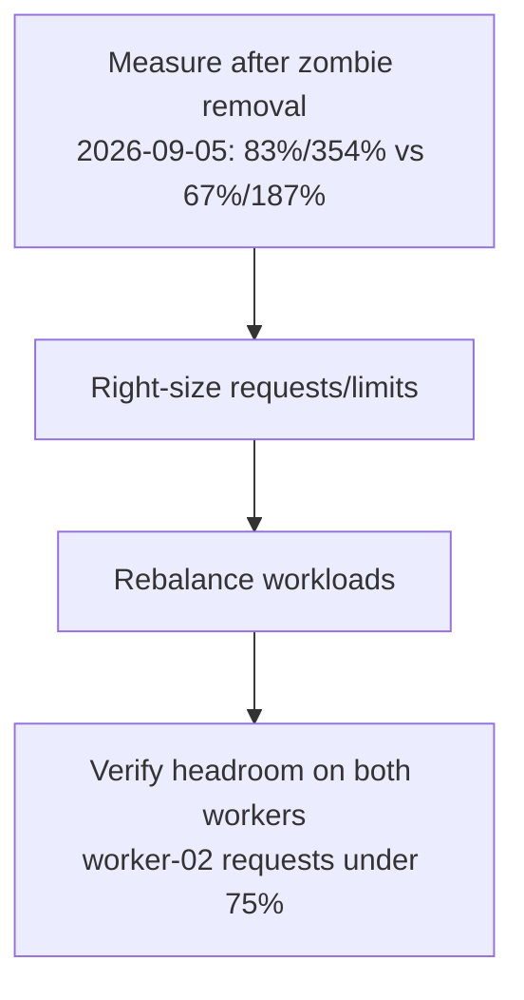

# Worker-02 Memory Rebalance — Implementation Plan

> **Issue:** #74 (T2) — Rebalance worker-02 memory (85% requests / 360% limits overcommit).
> **Branch:** docs-only sync (this file); implementation branch to be cut from the issue per the issue-to-pr-workflow skill.
> **Status:** **PLANNED 2026-09-05** — baseline re-measured after the zombie-replica removal; right-size + rebalance steps prepared. No manifest changes in this sync (docs-only).

## Why

worker-02 ran at 85% of memory requests (6738Mi/8Gi) and 360% of limits
(28552Mi) — the same overcommit pattern that killed worker-01 in July (kubelet
death from memory pressure). worker-01 has headroom. The two crash-looping
CNPG replicas inflated the numbers; they are gone as of 2026-09-05 (postgres
reconciled to spec 1 / status 1 / ready 1), so this plan records the new
baseline and the right-size + rebalance steps.

**2026-09-05 baseline (lead-verified, post-zombie-removal):** worker-02 at
**83% of requests / 354% of limits**; worker-01 at **67% of requests / 187%
of limits**. Limits overcommit on worker-02 is still far above the 200%
safety cap — the rebalance is still required.

## Goals

| # | Goal | Why |
|---|---|---|
| 1 | Re-measure after zombie-replica removal | Accurate baseline (done 2026-09-05: 83%/354% vs 67%/187%) |
| 2 | Right-size requests/limits in invenio manifests | Sane overcommit ratio (limits < 200% per node) |
| 3 | Rebalance workloads across workers | Use worker-01 headroom |

## Architecture

**Key principle:** requests = what the scheduler guarantees; limits = safety
cap. Overcommit >200% is a failure risk.

## Files Overview

| File | Type | Description |
|---|---|---|
| `k8s/apps/invenio/invenio-web-deployment.yaml` | To be modified | Right-size requests/limits |
| `k8s/apps/invenio/invenio-worker-deployment.yaml` | To be modified | Right-size |
| `k8s/apps/invenio/invenio-scheduler-deployment.yaml` | To be modified | Right-size |
| `k8s/apps/invenio/invenio-hpa.yaml` | To be modified if needed | Threshold adjustment |
| `docs/plans/active/2026-09-05-worker-02-rebalance.md` | New | This plan + measurements |
| `docs/plans/README.md` | Modified | Index update |

No manifest changes in this docs-only sync — files above are the
implementation scope for the follow-up wave. Do not touch `k8s/` here.

## Task Groups

- [x] **Group 1**: Measure post-zombie allocation (2026-09-05: worker-02 83%/354%, worker-01 67%/187%)
- [ ] **Group 2**: Right-size requests/limits (follow-up implementation wave)
- [ ] **Group 3**: Rebalance (nodeSelector/affinity if needed — prefer request/limit changes over affinity)
- [ ] **Group 4**: Verify + plan doc + index (doc part done in this sync)

## Acceptance Criteria

- [ ] kustomize build + yamllint pass
- [ ] worker-02 requests < 75% after rollout
- [ ] No OOM risk: limits overcommit < 200% per node
- [ ] App endpoints 200 after rollout
- [x] Plan doc + index updated (this sync)

## Risk Assessment

| Risk | Impact | Mitigation |
|---|---|---|
| Right-sizing too low causes OOM | High | Conservative: keep headroom, verify with metrics |
| Affinity changes pin pods badly | Medium | Prefer request/limit changes over affinity |
| Rollout blip | Low | PDBs exist (minAvailable 1) |

## Rollback Plan

1. Revert manifest changes
2. ArgoCD self-heals to previous state

## Affected Services

- invenio-web, invenio-worker, invenio-scheduler

## Verification Steps (post-rollout)

1. `kubectl describe node ubuntu-btd-kubernetes-worker-02 | grep -A5 Allocated` → requests < 75%, limits < 200%
2. Same for worker-01 → sane headroom on both nodes
3. `https://invenio.vityasy.me` and `https://api-invenio.vityasy.me` return 200
4. No OOMKilled events: `kubectl get events -A --field-selector reason=OOMKilled`
