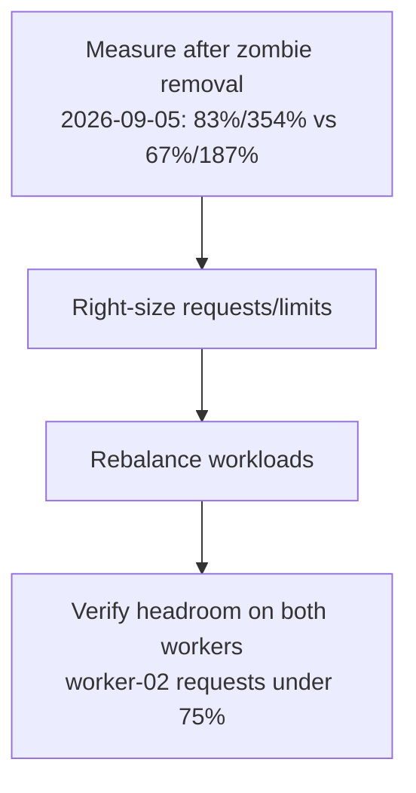

# Worker-02 Memory Rebalance — Implementation Plan

> **Issue:** #74 (T2) — Rebalance worker-02 memory (85% requests / 360% limits overcommit).
> **Branch:** feat/74-worker02-rebalance (worker branch cut fresh from origin/main).
> **Status:** **BLOCKED 2026-09-05 (worker re-measured)** — fresh `kubectl describe node`
> numbers are identical to the morning baseline (worker-02 **83.5% requests /
> 354.1% limits**, worker-01 **67.1% / 187.5%**). Computed the best conceivable
> in-scope proposed state: even with **zero** invenio pods on worker-02,
> worker-02 would sit at **77.0% requests / 328.3% limits** — the <75% / <200%
> targets are **mathematically unreachable** by touching only the four in-scope
> invenio files. NO manifest changes made (rollout churn with zero progress
> toward the goal). Escalated to lead — see `WORKER-REPORT.md` at worktree root
> for the proof and the scope-expansion question. No secrets touched.

## Why

worker-02 ran at 85% of memory requests (6738Mi/8Gi) and 360% of limits
(28552Mi) — the same overcommit pattern that killed worker-01 in July (kubelet
death from memory pressure). worker-01 has headroom. The two crash-looping
CNPG replicas inflated the numbers; they are gone as of 2026-09-05 (postgres
reconciled to spec 1 / status 1 / ready 1), so this plan records the new
baseline and the right-size + rebalance steps.

**2026-09-05 baseline (lead-verified, post-zombie-removal):** worker-02 at
**83% of requests / 354% of limits**; worker-01 at **67% of requests / 187%
of limits**. Limits overcommit on worker-02 is still far above the 200%
safety cap — the rebalance is still required.

**2026-09-05 ~16:48 +07 worker re-measurement (VPN up, read-only):**
identical — worker-02 **6610Mi req (83.48%) / 28040Mi lim (354.12%)**,
worker-01 **5315Mi req (67.12%) / 14849Mi lim (187.53%)** (8Gi nodes,
7918Mi allocatable). Postgres healthy at spec 1 / ready 1, recent backups
`completed`; zero OOMKilled events cluster-wide; actual memory use is fine
(server 43%, worker-01 48%, worker-02 59%) — the problem is purely
requests/limits accounting, dominated on worker-02 by NON-invenio workloads
(monitoring ≈12Gi limits, argocd ≈3.8Gi, search 2Gi, kube-system ≈2.1Gi,
traefik/minio/redis/database ≈1Gi each). Only ONE invenio pod runs on
worker-02 (`invenio-web-mf5n6`, 512Mi req / 2Gi lim). See "Worker
re-measurement" section below and `WORKER-REPORT.md` — targets proven
unreachable in the current file scope.

## Goals

| # | Goal | Why |
|---|---|---|
| 1 | Re-measure after zombie-replica removal | Accurate baseline (done 2026-09-05 twice: 83%/354% vs 67%/187%, confirmed 16:48 +07) |
| 2 | Right-size requests/limits in invenio manifests | **BLOCKED** — best in-scope outcome still 77%/328% on worker-02; needs scope expansion (see below) |
| 3 | Rebalance workloads across workers | **BLOCKED** — moving the lone worker-02 web pod to worker-01 puts worker-01 at 73.6%/213.4% (limits fail there too) |

## Architecture

**Key principle:** requests = what the scheduler guarantees; limits = safety
cap. Overcommit >200% is a failure risk.

## Files Overview

| File | Type | Description |
|---|---|---|
| `k8s/apps/invenio/invenio-deployment.yaml` (Deployment `invenio-web`; brief named it `invenio-web-deployment.yaml`, which does not exist) | Unchanged (blocked) | Right-size requests/limits — skipped, see proof below |
| `k8s/apps/invenio/invenio-worker-deployment.yaml` | Unchanged (blocked) | Right-size — skipped |
| `k8s/apps/invenio/invenio-scheduler-deployment.yaml` | Unchanged (blocked) | Right-size — skipped |
| `k8s/apps/invenio/invenio-hpa.yaml` | Unchanged | No threshold change needed (web 0%/70% cpu, 72%/80% mem; worker already at max 2/2) |
| `docs/plans/active/2026-09-05-worker-02-rebalance.md` | Modified | This update: fresh measurements + blocked status |
| `docs/plans/README.md` | Modified | Index row status update |
| `WORKER-REPORT.md` (worktree root) | New | Worker report: proof, verification outputs, escalation question |

No manifest changes in this wave — the worker proved the in-scope files
cannot reach the targets (see "Worker re-measurement"). Do not touch `k8s/`
until the lead resolves the scope question.

## Task Groups

- [x] **Group 1**: Measure post-zombie allocation (2026-09-05: worker-02 83%/354%, worker-01 67%/187% — re-confirmed 16:48 +07, identical)
- [ ] **Group 2**: Right-size requests/limits — **BLOCKED**, proven infeasible in scope (see "Worker re-measurement"); awaiting lead scope decision
- [ ] **Group 3**: Rebalance (nodeSelector/affinity if needed — prefer request/limit changes over affinity) — **BLOCKED**, same reason
- [x] **Group 4**: Verify + plan doc + index (worker verification done 2026-09-05: kustomize OK, yamllint clean, no OOMKilled; doc part updated in this wave)

## Acceptance Criteria

- [x] kustomize build + yamllint pass (verified 2026-09-05 on unchanged tree — render OK, yamllint clean)
- [ ] worker-02 requests < 75% after rollout — **BLOCKED** (best in-scope: 77.0%)
- [ ] No OOM risk: limits overcommit < 200% per node — **BLOCKED** (best in-scope: 328.3%)
- [ ] App endpoints 200 after rollout — n/a (no rollout; post-merge lead job)
- [x] Plan doc + index updated (this wave)

## Worker re-measurement 2026-09-05 ~16:48 +07 (VPN up, read-only kubectl)

Pod placement (invenio namespace): worker-01 hosts scheduler + web-4hhl4 +
worker-c4hcq + worker-n6pbn (HPA at max 2/2, cpu 168%/70%, mem 83%/80%);
worker-02 hosts only web-mf5n6. Observed usage (`kubectl top`): web 463Mi /
277Mi (req 512Mi), worker 584Mi / 755Mi (req 768Mi), scheduler 211Mi (req
256Mi) — all comfortably under limits, so no live OOM pressure (node memory
use: server 43%, worker-01 48%, worker-02 59%; zero OOMKilled events).

Impossibility proof (per-node math, other namespaces unchanged, 7918Mi
allocatable per worker):
worker-02 non-invenio requests = 6610 − 512 = 6098Mi = **77.0%** (already
over the 75% budget of 5938.7Mi by 160Mi) and non-invenio limits =
28040 − 2048 = 25992Mi = **328.3%** (over the 200% budget of 15836.6Mi by
12203Mi). So even with ZERO invenio on worker-02, both targets fail; moving
the web pod to worker-01 instead puts worker-01 at 73.6% / **213.4%**
(limits fail there). Halving the web limit in place only reaches 341.2%.
The overcommit is systemic (monitoring ≈12Gi limits on worker-02) and cannot
be fixed from the four in-scope invenio files. Worker-safe invenio cuts were
considered and deliberately NOT applied (rollout restarts for ~13 points of
limits relief that leaves the node at 341% — risk without progress).
Escalation question for the lead is recorded in `WORKER-REPORT.md`.

## Risk Assessment

| Risk | Impact | Mitigation |
|---|---|---|
| Right-sizing too low causes OOM | High | Conservative: keep headroom, verify with metrics |
| Affinity changes pin pods badly | Medium | Prefer request/limit changes over affinity |
| Rollout blip | Low | PDBs exist (minAvailable 1) |

## Rollback Plan

1. Revert manifest changes
2. ArgoCD self-heals to previous state

## Affected Services

- invenio-web, invenio-worker, invenio-scheduler

## Verification Steps (post-rollout)

1. `kubectl describe node ubuntu-btd-kubernetes-worker-02 | grep -A5 Allocated` → requests < 75%, limits < 200%
2. Same for worker-01 → sane headroom on both nodes
3. `https://invenio.vityasy.me` and `https://api-invenio.vityasy.me` return 200
4. No OOMKilled events: `kubectl get events -A --field-selector reason=OOMKilled`
