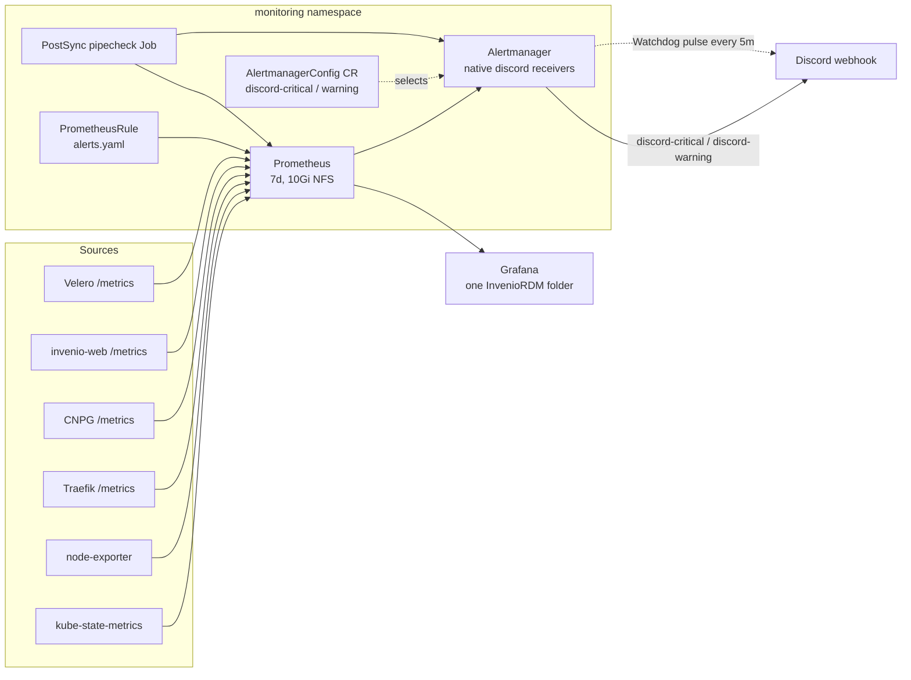

# Monitoring Overhaul — Consolidated Dashboards + Actionable Discord Alerts

> **Date:** 2026-09-08
> **Tier:** T2 (`feat/<issue>-monitoring-overhaul`)
> **Status:** IMPLEMENTED on branch, awaiting lead verification + VPN live-checks
> **Scope:** `k8s/infra/monitoring/**`, `.github/workflows/validate-infra.yaml`, `scripts/ci-validate-monitoring.sh`, docs. Out of scope: chart version bumps, sealed-secret rotations, other components' manifests.
> **Companion docs:** `docs/plans/active/2026-09-03-architecture-and-dr.md` (failure modes), `docs/cluster-assessment-2026-09-05.md` (live baseline).

## Why

The monitoring stack works but does not serve its audience. Three complaints from
the operator, each traceable to the repo:

1. **Scattered dashboards** — `k8s/infra/monitoring/grafana-dashboards.yaml` ships 5
   ConfigMaps with 5 different `grafana_folder` values (`Kubernetes`, `Traefik`,
   `Velero`, `MinIO`, `Invenio`) and no entry point or cross-links. The Grafana
   sidecar uses `foldersFromFilesStructure: true`, so the scatter is by design.
2. **Bloat, not use cases** — panels mostly show raw requests/RPS with no
   thresholds or "so what" and are duplicated across dashboards (RPS/error
   graphs appear in both Traefik and Invenio dashboards).
3. **Alerts not wired up** — `alerts.yaml` opens with `PodCrashLooping:
   rate(...) > 0` (fires on any single restart); `critical` and `warning` both
   route to the same `discord` receiver; `Watchdog -> null` hides pipeline
   death; and Discord delivery depends on a third-party bridge Deployment
   (`benjojo/alertmanager-discord:latest`, unpinned, no probes, unmonitored)
   that Alertmanager's native `discord_config` receiver (available since AM
   v0.25; ours is ~v0.27/0.28 via chart 69.6.0) makes entirely unnecessary.

The operator's keep-list (all five signal groups are required; noise is cut
instead of coverage): **A** app serving, **B** data safety, **C** capacity,
**D** edge, **E** platform self-health.

## Goals

| # | Goal | Why |
|---|------|-----|
| 1 | One `InvenioRDM` Grafana folder, `00 Overview` as the 30-second entry point, max 3 drill-downs | Kills the scatter; answers "is it healthy and what broke" without CLI |
| 2 | Every panel has a threshold or action meaning; remove duplicated/no-op panels | Bloat removal without losing A–E coverage |
| 3 | Every alert actionable: severity routing, anti-flap `for:`, `runbook_url` + dashboard link | Alerts must never page without an action |
| 4 | Two Discord tiers via native `discord_config` + `Watchdog` heartbeat | Silence becomes visible; critical vs quiet information; no bridge to operate |
| 5 | Pipe is self-monitored and provable (PostSync pipecheck, test alert, `amtool`) | "Wired up" becomes verifiable, not assumed |
| 6 | CI catches bad rules/dashboards statically; live delivery proven in-cluster | Bugs stop at PR time; delivery stops silently rotting |

## Architecture

**Key principle:** one entry-point dashboard answers health in 30 seconds; every
alert deep-links to the exact dashboard panel and a runbook; the pipeline
itself is monitored so silence means broken, not healthy.

## Section 1 — Dashboards: one folder, 4 dashboards, zero bloat

All dashboards in `k8s/infra/monitoring/grafana-dashboards.yaml` get
`grafana_folder: InvenioRDM` and ordered titles: `00 Overview`, `01 App`,
`02 Data & Backups`, `03 Platform`. `00 Overview` carries `links` to the other
three; each alert in `alerts.yaml` deep-links to its panel. The existing five
ConfigMaps collapse into this single file.

| Dashboard | Audience question | Panels (kept/new) | Deleted |
|---|---|---|---|
| `00 Overview` | Is it healthy in 30s? What broke? | Traefik RPS + 5xx% (threshold 2%), web available/desired, PG Ready + ContinuousArchiving (0/1 red), oldest successful CNPG backup age, Velero last-success age, nodes Ready count, Alertmanager→Discord delivery heartbeat, PVC max% | — |
| `01 App` | Can researchers deposit/search/download? | p95 latency per route, 4xx/5xx by code, Celery queue depth (Redis), worker restarts, OpenSearch cluster status + pending shards, DB connections % + replication lag | duplicated RPS/error graphs copied from Traefik |
| `02 Data & Backups` | Can we recover? | CNPG backup success/fail by schedule, WAL archiving errors, Velero attempts vs success + plugin-restart counter (#91 visible), MinIO free% + S3 error ratio, Released-PV count (Task 16 hygiene) | — |
| `03 Platform` | Is the floor solid? | node CPU/mem/disk vs requests/limits (post-#74 headroom), OOM-kill rate, tunnel up, Prometheus target-down count, Alertmanager config reload failures, kubelet-502/remotedialer recurrence (machineID flap detector) | raw "requests by namespace" timeseries without thresholds |

## Section 2 — Alerts: same 5 signals, every alert earns its place

**Routing (native `discord_config`, no bridge):** `critical` → `discord-critical`
receiver (`[CRITICAL]` title prefix via Alertmanager templating) +
`runbook_url` + dashboard link; `warning` → quiet `discord-warning` + same
links; `Watchdog` (always firing) → `discord-warning` heartbeat so `>10m`
silence = broken pipe. `group_wait 30s`, `group_interval 5m`,
`repeat_interval` 2h critical / 12h warning. Inhibit rule: a `critical`
suppresses its sibling `warning` (no double-post). Receivers live in an
`AlertmanagerConfig` CR (webhook URL from the existing sealed
`alertmanager-discord-webhook` by key — never plaintext in git); the base
route tree in `values.yaml` references them.

**Keep / fix / delete map:**

- **A — App serving:** keep `InvenioWebReplicasUnavailable` (add runbook +
  `01 App` link), keep 5xx>2%/10m, add `TraefikServiceDown` (no healthy
  backends). **Delete** `InvenioTraffic4xxRatioHigh > 10%` as page-worthy alert
  (demote to `00 Overview` panel; 4xx is usually client/routing, not a page).
  `InvenioPodRestartHigh`: `>3/30m` → `>5/1h, for 15m`.
- **B — Data safety:** keep `VeleroBackupFailed`, `VeleroBackupStale>8d`,
  `PostgreSQLHighConnections>80%`, `CNPGReplicationLag>30s`; add
  `CNPGBackupStale>26h` (daily schedule + 2h grace — catches the 2026-08-21
  deadlock class), `CNPGArchivingDown` (`ContinuousArchiving==False`, for 15m),
  `VeleroPluginCrashlooping` (makes #91 visible). **Delete** generic
  `velero_backup_attempt - velero_backup_success > 0`.
- **C — Capacity:** keep `HighMemoryUsage<10% avail`, `NodeDiskPressure`,
  `InvenioPVCUsageHigh>80%/15m`; add `OOMKillsIncreasing`
  (`rate(terminated_reason=="OOMKilled"[30m]) > 0, for 15m` — Redis class).
  **Replace** `PodCrashLooping rate>0/5m` with crashloop-with-down
  (`rate(restarts[15m]) > 0 AND up == 0`-style, `for 15m`) so a single restart
  never pages.
- **D — Edge:** keep `CloudflareTunnelDown (up==0, 3m)`, keep
  `TraefikHigh404Rate>5%/5m` (add runbook: IngressRoute + netpol + endpoints).
- **E — Platform self (new):** `PrometheusTargetDown` (>10% targets down, 10m),
  `AlertmanagerConfigFailed`, `KubeStateMetricsDown`,
  `AlertmanagerNotificationsFailing`
  (`rate(alertmanager_notifications_failed_total[10m]) > 0`, critical —
  carries a discord `reason` label on recent AM). There is deliberately no
  bridge-health alert: the bridge is deleted (see §3), so the failure mode
  does not exist. Delivery silence itself is caught by the absent `Watchdog`
  pulse (runbook: no heartbeat in 10m → investigate pipe) and by the
  pipecheck Job — a `WatchdogMissing` PrometheusRule cannot detect
  Discord-side death because nothing evaluates once the pipeline is down.

Every alert carries `summary` + `description` ("so what") + `runbook_url` +
dashboard annotation. CI enforces this (Section 4).

## Section 3 — Discord delivery: delete the bridge, go native

Alertmanager has shipped a native `discord_config` receiver since v0.25
(`webhook_url` / `webhook_url_file`, templated `title`/`message`/`content`);
chart 69.6.0 bundles ~v0.27/0.28, so the third-party bridge is pure overhead:
an unpinned image, a Deployment + Service + NetworkPolicy to operate, and a
whole failure mode (`DiscordBridgeDown`) that vanishes when the bridge does.

- **Delete the bridge stack:** remove `alertmanager-discord-deployment.yaml`,
  `alertmanager-discord-service.yaml`, `alertmanager-discord-netpol.yaml`
  (and their `kustomization.yaml` entries). The SealedSecret
  `alertmanager-discord-webhook` STAYS — the new receiver references it by
  key, so the URL never appears in plaintext.
- **Two native receivers in one `AlertmanagerConfig` CR** (new file
  `k8s/infra/monitoring/discord-receivers.yaml`, namespace `monitoring`):
  `discord-critical` (`[CRITICAL]` title prefix, `repeat_interval 2h`) and
  `discord-warning` (quiet, `repeat_interval 12h`), both `discord_configs`
  with the webhook URL from the sealed Secret and `message` templates carrying
  the runbook link. The CR is self-contained: route sub-tree + receivers
  (`spec.route`: Watchdog → `discord-warning` every 5m;
  `severity: critical` → `discord-critical`; `severity: warning` →
  `discord-warning`; default receiver `discord-warning`); the base in
  `values.yaml` keeps root (`receiver: null`) + inhibit critical-over-warning
  only, so the base Secret stays valid standalone. `values.yaml` also sets
  `alertmanagerConfigMatcherStrategy: {type: None}` so the CR route applies
  cluster-wide (default `OnNamespace` would gate it to `namespace=monitoring`).
- **Prove the plumbing statically:** the worker pulls chart 69.6.0
  (`helm pull prometheus-community/kube-prometheus-stack --version 69.6.0`),
  confirms the bundled Alertmanager image is ≥v0.25, reads the
  `alertmanagerconfigs` CRD schema for `route`/`receivers.discordConfigs`/
  `inhibitRules` support, and finds the `alertmanagerConfigSelector` key path
  in `helm show values`. If any of this does not fit, the fallback is the
  previously approved pinned-bridge design (recorded in git history) — but
  that outcome is not expected.
- **Proof of delivery:** `Watchdog → discord-warning` every 5m; a PostSync
  `monitoring-pipecheck` Job (in-cluster) checks Prometheus/Alertmanager
  `/-/ready` and fires a `MonitoringPipeTest` alert; sync shows red in ArgoCD
  if the pipe is broken. Human confirms the test message lands once per
  change (runbook one-liner).

## Section 4 — CI/verify: prove it before and after merge

Constraint: GitHub runners cannot reach `btd-rke2` metrics (university VPN
only). Proof splits in two.

**Static (CI, no cluster):** new `validate-monitoring` job in
`validate-infra.yaml` running `promtool check rules
k8s/infra/monitoring/alerts.yaml` plus `amtool check-config` against the
rendered Alertmanager configuration (the whole routing tree *including* the
discord receivers is statically provable now — the bridge's behavior never
was), plus `scripts/ci-validate-monitoring.sh`
which extracts each `data.*.json` from `grafana-dashboards.yaml`, runs
`jq empty` on each, asserts every dashboard has `uid + title + tags`, every
alert has `severity + summary + runbook_url + dashboard`, every dashboard
carries `grafana_folder: InvenioRDM` (scatter cannot regress), and asserts
the Watchdog route targets `discord-warning` (never `null`).

**Live (in-cluster):** `deploy-verify.yaml` keeps ArgoCD Sync + `/ping` smoke
(no new runner→VPN dependency). The `monitoring-pipecheck` PostSync Job proves
delivery where the cluster lives. Human confirms the test message in Discord
once per change; the steady `Watchdog` pulse proves it stays up.

## Section 5 — Workflow: planning → branch → PR → verification → cleanup

1. **Issue:** T2 `[T2] Monitoring overhaul — consolidated dashboards +
   actionable Discord alerts` with Why / Goals / Mermaid / Files / Task Groups
   G1–G5 / Acceptance Criteria. Branch `feat/<issue>-monitoring-overhaul` from
   `origin/main` after `git fetch` (`origin/main..HEAD` count 0), worktree in
   `.worktrees/`.
2. **Worker:** one worker (single component area, no file overlap). Herd brief
   with scope `k8s/infra/monitoring/**` + `validate-infra.yaml` +
   `scripts/ci-validate-monitoring.sh` + docs; do-not-touch: sealed secret
   *values*, chart versions, other components; output `WORKER-REPORT.md`;
   escalation = stop and report. Secrets (if any) typed by the operator via
   `herd attach`, never by the lead.
3. **Task groups:** G1 dashboards (Sec 1) → G2 alerts (Sec 2) → G3 native Discord
   (Sec 3: delete bridge, add CR, rewire routes) + pipecheck → G4 CI script +
   amtool + workflow job (Sec 4) →
   G5 docs/index (this file + `docs/plans/README.md`).
4. **Verification:** worker runs `yamllint`, `ci-render-manifests.sh` +
   kubeconform + `ci-validate-selectors.sh` + `ci-validate-monitoring.sh` +
   `promtool check rules`, shows outputs. Lead reads the diff, pushes, opens the
   PR (`Closes #<n>`), `gh pr checks --watch` til green. On VPN: full
   `verify-infra.sh`, ArgoCD 17/17 + pipecheck green, Grafana shows one folder /
   4 dashboards, `MonitoringPipeTest` confirmed in Discord, `/ping` 200.
5. **Merge + cleanup + rollback:** squash-merge only; close the spawned pane,
   remove worktree + worker branch; move this plan to `completed/` + update
   index; `git status` clean. Rollback: `git revert <squash-sha>` → ArgoCD
   auto-syncs back ~30s → Watchdog pulse confirms. No migrations, no
   destructive edits.

## Files Overview

| File | Type | Description |
|---|---|---|
| `k8s/infra/monitoring/grafana-dashboards.yaml` | Modified | 5 scattered ConfigMaps → 4 dashboards, one folder, links, thresholds |
| `k8s/infra/monitoring/alerts.yaml` | Modified | Rewrite into A–E groups; runbook/dashboard annotations |
| `k8s/infra/monitoring/values.yaml` | Modified | Alertmanager route tree (Watchdog/critical/warning) + inhibit; references CR receivers |
| `k8s/infra/monitoring/discord-receivers.yaml` | New | `AlertmanagerConfig` CR: `discord-critical` + `discord-warning` receivers (secret keyRef, templates) |
| `k8s/infra/monitoring/alertmanager-discord-deployment.yaml` | Deleted | Bridge removed — failure mode deleted with it |
| `k8s/infra/monitoring/alertmanager-discord-service.yaml` | Deleted | Bridge removed |
| `k8s/infra/monitoring/alertmanager-discord-netpol.yaml` | Deleted | Bridge removed |
| `k8s/infra/monitoring/alertmanager-discord-secret.yaml` | Kept | Still the sealed webhook source, now referenced by the CR |
| `k8s/infra/monitoring/monitoring-pipecheck.yaml` | New | PostSync Job proving Prometheus/Alertmanager ready + test-alert delivery |
| `k8s/infra/monitoring/kustomization.yaml` | Modified | Add new resources |
| `.github/workflows/validate-infra.yaml` | Modified | New `validate-monitoring` job (promtool + script) |
| `scripts/ci-validate-monitoring.sh` | New | Dashboard JSON + annotation + folder assertions |
| `docs/plans/active/2026-09-08-monitoring-overhaul.md` | New | This spec (moves to `completed/` on merge) |
| `docs/plans/README.md` | Modified | Index row |

## Task Groups

- [ ] **G1**: Dashboards — one `InvenioRDM` folder, `00 Overview` + `01 App` +
  `02 Data & Backups` + `03 Platform`, cross-links, thresholds.
- [ ] **G2**: Alerts — rewrite `alerts.yaml` into groups A–E with severity,
  `for:`, `runbook_url`, dashboard annotations; delete noise alerts.
- [ ] **G3**: Discord native — delete bridge Deployment/Service/NetPol, add
  `AlertmanagerConfig` CR with two `discord_configs` receivers, rewire
  `values.yaml` routes, `Watchdog` heartbeat, PostSync pipecheck Job.
- [ ] **G4**: CI — `promtool` + `amtool check-config` +
  `scripts/ci-validate-monitoring.sh` job in `validate-infra.yaml`.
- [ ] **G5**: Docs — this plan + `docs/plans/README.md` row; update cluster
  assessment if live state changes.

## Acceptance Criteria

- [ ] ArgoCD `monitoring` + `monitoring-extras` Synced+Healthy; `validate-infra.yaml` and `deploy-verify.yaml` green on the PR.
- [ ] Grafana shows exactly one `InvenioRDM` folder with 4 dashboards, no other monitoring dashboards from this repo.
- [ ] `promtool check rules` passes in CI; `ci-validate-monitoring.sh` fails on a deliberately broken dashboard/annotation (worker verifies negative case).
- [ ] `MonitoringPipeTest` alert delivered to Discord and confirmed by the operator; `Watchdog` pulse visible.
- [ ] `AlertmanagerNotificationsFailing` / `AlertmanagerConfigFailed` / `PrometheusTargetDown` fire when their condition is simulated (at least one exercised in a canary); no `alertmanager-discord` Deployment/Service remains.
- [ ] No alert fires on a single pod restart; no alert without `runbook_url` + dashboard annotation.
- [ ] `deploy-verify.yaml` smoke (`/ping` 200) passes after merge; rollback path (`git revert`) documented in the PR.

## Risks

| Risk | Impact | Mitigation |
|---|---|---|
| Alert rewrite misses a signal the old rules covered | Blind spot | Keep/delete map above is exhaustive; CI asserts annotations; operator reviews diff vs old `alerts.yaml` |
| AlertmanagerConfig selector plumbing differs from the chart docs | Receivers never merge, alerts go nowhere | Worker proves `alertmanagerConfigSelector` key path + CRD schema from pulled chart 69.6.0 before writing the CR; pipecheck + Watchdog pulse confirm live; fallback is the git-history pinned-bridge design |
| PostSync Job fails on transient Prometheus scrape delay | ArgoCD sync red noise | Job retries with backoff; `for:` windows and 2h grace on `CNPGBackupStale` |
| Two receivers post to the same webhook = duplicates if routing misconfigured | Discord spam | Inhibit rule + `continue: false`; test alert exercised in canary |
| Watchdog route mis-set to `null` again | Silence returns | CI assertion (script greps the Watchdog receiver name) + `AlertmanagerNotificationsFailing` + pipecheck checks the receiver name |

## Open Questions

1. `AlertmanagerConfig` selector key path + `inhibitRules` CRD support in chart 69.6.0 — resolved statically by the worker (`helm pull` + CRD read) before writing the CR.
2. PostSync pipecheck and the existing `invenio-setup-job` hook interplay — keep hooks in their own paths; verify no ArgoCD hook ordering conflict at implementation.

## Operator actions (unchanged, owned elsewhere)

machineID IT ticket, sealed-secrets key backup, off-site R2/S3 decision, Velero
plugin/quota fix, single-PG HA, SMTP relay credentials, restore drills — all
remain in their existing `docs/plans/active/` plans. This overhaul makes each
one *visible* through alerts/link runbooks; it does not fix them.
