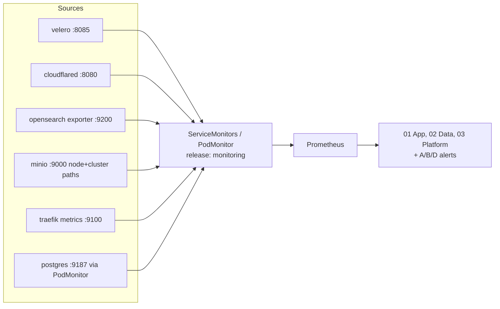

# Monitoring Scrapes — Wire the Missing Prometheus Targets (wave-2, #105)

> **Date:** 2026-09-14
> **Tier:** T2 (`feat/105-monitoring-scrapes`)
> **Status:** IMPLEMENTED on branch, awaiting lead verification + VPN live-checks
> **Scope:** velero / cloudflared / opensearch / minio / traefik / postgresql scrape
> wiring, invenio-SM removal, Alertmanager `matchers:` migration, validator
> pins. Out of scope: chart version bumps, sealed-secret values, invenio app image.
> **Companion docs:** `docs/plans/active/2026-09-08-monitoring-overhaul.md`
> (wave-1: dashboards/alerts whose panels this wave lights up).

## Why

Live evidence (`count by (job) (up)` on 2026-09-14): Prometheus scrapes only
chart-default targets + `invenio-web`. Six jobs have NO scrape config, so
wave-1 dashboards/alerts referencing them are blank/dormant: traefik, velero,
minio, opensearch, cloudflared, postgres. Separately, `invenio-web /metrics`
returns empty (`up==0` forever) — its ServiceMonitor and panel are decoration.
This wave wires the sources; every blank panel and dormant alert lights up.

## Goals

| # | Goal | Why |
|---|------|-----|
| 1 | Scrape velero `:8085`, cloudflared `:8080` (both already expose) | Trivial ServiceMonitors; backs Velero + tunnel panels/alerts |
| 2 | Fix opensearch + minio scrapes (enabled in values, zero live series) | Diagnose selector/port mismatch, fix |
| 3 | Enable traefik Prometheus metrics + scrape | Backs all traffic SLO panels/alerts (5xx, p95, 404) |
| 4 | CNPG PodMonitor: manual resource, operator flag off | Backs DB connections/lag/backup-age alerts + panels |
| 5 | Remove invenio-web ServiceMonitor (endpoint serves nothing) | Anti-bloat: no permanent-zero decoration |
| 6 | Migrate `match:`-style routing → `matchers:` | Operator logs deprecation warnings; future AM removes old syntax |

## Architecture

**Key principle:** no new exporters where endpoints already exist; every metric
proven live (`up` + sample query) by the lead before a panel/alert is claimed.

## What was done (per group, with proof)

### G1 — Velero + cloudflared (endpoints existed)

- `k8s/infra/velero/velero-servicemonitor.yaml` (new): SM `velero/monitoring`,
  `release: monitoring`, selector exactly the chart Service labels
  (`app.kubernetes.io/name+instance: velero`), endpoint `http-monitoring`
  (`:8085`, render-proven in `rendered/helm_velero.yaml`).
- `external-lb/k8s/cloudflared-service.yaml` (new): ClusterIP `cloudflared`,
  selector `app: cloudflared` (matches DaemonSet pod labels), port `metrics: 8080`
  (matches `--metrics 0.0.0.0:8080` arg; `/metrics` path per Cloudflare docs).
- `external-lb/k8s/cloudflared-servicemonitor.yaml` (new): SM `kube-system`,
  `release: monitoring`, selects the Service above. Job `kube-system/cloudflared`
  matches the existing `CloudflareTunnelDown` regex (`.*cloudflared.*`) and the
  `03 Platform / Tunnel up` panel — no alert/dashboard edit needed.
- Chart alternative rejected for velero: chart 11.4.0 `metrics.serviceMonitor`
  exists but `autodetect: true` suppresses it under `helm template` (CI render
  could never prove it); standalone manifest is render-proven instead.

### G2 — OpenSearch (wrong chart keys + missing plugin)

- Diagnosis: our values used `metricsExporter.*` — chart 2.32.0 has NO such key
  (pulled-chart inspection: only top-level `serviceMonitor` + `plugins`). The old
  block rendered nothing, and without the exporter plugin `/_prometheus/metrics`
  does not exist.
- Fix (3 synced copies): `k8s/apps/invenio-deps/opensearch/values.yaml`,
  `argocd/apps/invenio-opensearch.yaml` valuesObject,
  `scripts/ci-render-manifests.sh` OPENSEARCH_VALUES → `serviceMonitor.enabled`,
  `path: /_prometheus/metrics`, `labels: {release: monitoring}` +
  `plugins.installList: [prometheus-exporter-2.19.1.0.zip]`.
- Plugin pin proven: tag `2.19.1.0` exists (exact match for AppVersion 2.19.1),
  asset URL verified via GitHub API (149718 bytes). Repo moved
  `aiven/…` → `opensearch-project/opensearch-prometheus-exporter`.
- Render proof: SM `search/opensearch-cluster-master-service-monitor` carries
  `release: monitoring`, selector matches the master Service, endpoint
  `http:9200 /_prometheus/metrics`; StatefulSet renders the plugin-install step.
- Restarts the OpenSearch pod (plugin install). Lead-sequence off-peak.

### G3 — MinIO (unselected Probe, missing node SM)

- Diagnosis: `metrics.serviceMonitor.enabled: true` alone renders ONLY a
  cluster-metrics `Probe` (chart template gates the SM on `includeNode`), and
  both objects carried `release: minio` — Prometheus (`release: monitoring`
  selector on SM/Probe alike) selected neither. Zero live series explained.
- Fix (`k8s/infra/minio/values.yaml`): `includeNode: true` (renders node SM
  `/minio/v2/metrics/node`, selector matches the `monitoring: "true"` Service),
  `interval/scrapeTimeout 30s/10s`, `additionalLabels: {release: monitoring}`
  (render-parse-proven last-key-wins over the chart-default `release: minio`).
  `public: true` kept (chart default) — no bearer auth needed, no 401 class.

### G4 — Traefik + PostgreSQL

- Traefik (`k8s/infra/traefik/values.yaml`, chart 39.0.6 keys via
  `helm show values`): `metrics.prometheus.service.enabled: true` (dedicated
  `traefik-metrics:9100` Service; Deployment already ran
  `--metrics.prometheus=true` by chart default) + `serviceMonitor.enabled: true`
  with `release: monitoring`, `disableAPICheck: true` (CI renders without CRDs;
  in-cluster CRDs exist). Render proof: Service + SM + Deployment args all
  present. Rolling restart of 2 replicas on merge — off-peak.
- PostgreSQL: `monitoring.enablePodMonitor` is **deprecated in CNPG 1.25**
  (upstream monitoring.md: "manually create and manage a PodMonitor") AND the
  Cluster CRD offers no `podMonitorLabels` field, so the operator object cannot
  carry `release: monitoring` — selector mismatch proven from chart evidence.
  Fix: flag set `false` in `cluster.yaml` (operator object goes away, no double
  scrape) + hand-managed `postgres-podmonitor.yaml` (`release: monitoring`,
  selector `cnpg.io/cluster: postgres` per upstream docs, port `metrics:9187`).
  Single-instance restart possible on flag change — off-peak.

### G5 — Cleanup + routing + validator

- Deleted `k8s/infra/monitoring/invenio-servicemonitor.yaml` + kustomization
  entry. Dead-panel check: no dashboard panel references job `invenio-web`
  (all invenio panels are KSM/traefik-backed) — SM deletion only, no JSON edit.
- `values.yaml` inhibit_rules `source_match:/target_match_re:` →
  `source_matchers:/target_matchers:` (CR already used `matchers:`).
  `amtool v0.28.0 check-config` on the stub-merged tree: SUCCESS.
- `scripts/ci-validate-monitoring.sh` extended: invenio-SM absent,
  matchers-only routing (anchored exact-key regex, `matchNames`/`matchers` safe),
  source-key pins for all six scrapes + stale-`metricsExporter` tripwires in all
  three opensearch copies.

## Task Groups

- [x] **G1**: Velero + cloudflared scrapes (commit `04492eb`)
- [x] **G2**: OpenSearch diagnosis + fix (commit `44e9fe3`)
- [x] **G3**: MinIO diagnosis + fix (commit `23c36e6`)
- [x] **G4**: Traefik + CNPG PodMonitor (commit `11e4a20`)
- [x] **G5**: invenio-SM drop, `matchers:`, validator (commit `2438fdd`)
- [ ] **G6**: Docs + report (this file, index row, WORKER-REPORT.md) + lead live proof

## Acceptance Criteria

- [x] `yamllint`, render, selectors, validator, promtool, amtool green (log in WORKER-REPORT.md)
- [x] Negative case proven (validator red → restore → green, logged)
- [ ] Lead verifies live post-merge per item: `up{job=~"…"} == 1` + one sample query (procedures below)
- [ ] Blank panels render; dormant alerts evaluate (pending, not nodata-broken)
- [x] No `match:`-style routing remains; validator enforces
- [ ] `deploy-verify.yaml` green; rollback = `git revert`

## Lead live-proof procedures (VPN, post-merge)

For each job: `up{job="<job>"} == 1` present, then the sample query returns data.

| # | Job (`up`) | Sample data query | Lights up |
|---|---|---|---|
| 1 | `up{job="monitoring/velero"} == 1` | `(time() - velero_backup_timestamp) / 3600` | Overview Velero age; Data Velero panels; `VeleroBackupFailed/Stale` |
| 2 | `up{job="kube-system/cloudflared"} == 1` | `count by (__name__)({job="kube-system/cloudflared"})` (tunnel series present) | Platform Tunnel up; `CloudflareTunnelDown` |
| 3 | `up{job=~"search/opensearch.*"} == 1` | `count by (__name__)({job=~"search/opensearch.*"})` then `opensearch_cluster_status`-family renders in 01 App | 01 App OpenSearch status |
| 4 | `up{job="minio/minio"} == 1` (node SM) and `up{job="minio"}` (cluster Probe) | `sum(minio_cluster_capacity_usable_total_bytes)` | Data MinIO panels |
| 5 | `up{job="traefik"} == 1` | `sum(rate(traefik_service_requests_total[5m]))` | Overview/App traffic panels; `Invenio5xxRatioHigh`, `TraefikHigh404Rate`, `TraefikServiceDown` |
| 6 | `up{job="database/postgres"} == 1` | `cnpg_collector_up` | 01 App PG panels; `PostgreSQLHighConnections`, `CNPGReplicationLagHigh`, `CNPGBackupStale`, `CNPGArchivingDown` |

Negative check: `up{job="monitoring/invenio-web"}` must be ABSENT (SM deleted).

## Risk Assessment

| Risk | Impact | Mitigation |
|---|---|---|
| Traefik metrics enablement restarts pods | Brief ingress rollout (2 replicas, rolling) | Off-peak merge; Traefik health + `/ping` smoke after sync |
| CNPG flag triggers instance rollout restart | DB pod restart (single instance = brief app blip) | Merge off-peak; verify primary healthy + app smoke after |
| OpenSearch plugin install restarts the node | Search briefly unavailable | Off-peak; single-node cluster, app degrades not dies |
| MinIO metrics path needs auth | Scrape 401s | `public: true` kept (chart default); lead confirms `up==1` |

## Rollback Plan

1. `git revert <squash-sha>` → ArgoCD re-syncs (~30s)
2. Verify: Grafana back to pre-wave panels, ArgoCD all Synced+Healthy, `/ping` 200

## Affected Services

- traefik (rolling restart on metrics Service/SM — pods already ran the flags)
- database/postgres (possible single-instance restart on monitoring flag)
- search/opensearch (restart on plugin install)
- monitoring (validator, AM inhibit syntax)
- No changes to invenio app image or sealed secrets

## Files Overview

| File | Type | Description |
|---|---|---|
| `k8s/infra/velero/velero-servicemonitor.yaml` | New | Scrape existing `:8085` |
| `external-lb/k8s/cloudflared-service.yaml` | New | Metrics Service `:8080` for DaemonSet pods |
| `external-lb/k8s/cloudflared-servicemonitor.yaml` | New | Scrape the Service above |
| `k8s/apps/invenio-deps/opensearch/values.yaml` | Modified | Correct SM keys + exporter plugin |
| `argocd/apps/invenio-opensearch.yaml` | Modified | valuesObject synced with above |
| `scripts/ci-render-manifests.sh` | Modified | OPENSEARCH_VALUES synced with above |
| `k8s/infra/minio/values.yaml` | Modified | includeNode + release label |
| `k8s/infra/traefik/values.yaml` | Modified | Metrics Service + ServiceMonitor |
| `k8s/apps/invenio-deps/postgresql/cluster.yaml` | Modified | `enablePodMonitor: false` + rationale |
| `k8s/apps/invenio-deps/postgresql/postgres-podmonitor.yaml` | New | Manual PodMonitor (`release: monitoring`) |
| `k8s/infra/monitoring/invenio-servicemonitor.yaml` | Deleted | Endpoint serves nothing |
| `k8s/infra/monitoring/values.yaml` | Modified | inhibit `matchers:` syntax |
| `scripts/ci-validate-monitoring.sh` | Modified | #105 pins (SMs, no-match, no-invenio-SM) |
| `docs/plans/active/2026-09-14-monitoring-scrapes.md` | New | This plan |
